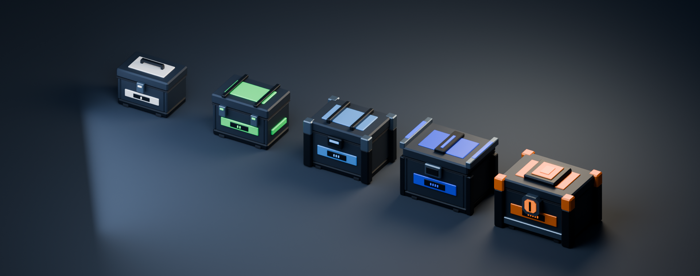
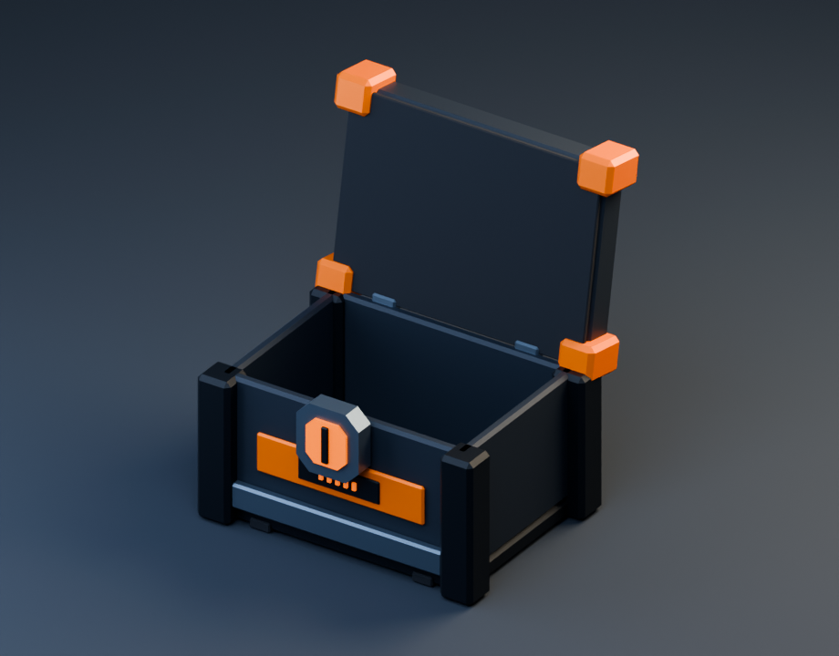

# 夜战回收区 / 五级补给宝箱

五级掉落箱沿用当前地图的深蓝灰钢壳、炭黑防撞框和少量裸钢边。稀有度颜色保持原 `ChestSpawner` 配置：白、青绿、浅蓝、靛蓝、橙；没有按旧枚举注释改成紫色或红色。层级同时通过轮廓、锁具和正面的 1–5 道短标记识别。

| 稀有度 | 结构辨识 | 三角形 | GLB | Unity 宽 × 高 × 深（米） |
|---|---|---:|---:|---|
| Common | 白色工具箱、提把、中央单扣 | 924 | 71.4 KiB | 1.020 × 0.817 × 0.783 |
| Uncommon | 青绿加强箱、双扣、贯穿绑带 | 1,100 | 84.5 KiB | 1.136 × 0.866 × 0.869 |
| Rare | 浅蓝运输箱、四角装甲、加厚顶肋 | 1,320 | 100.7 KiB | 1.290 × 0.984 × 1.036 |
| Epic | 靛蓝能量箱、双侧保护框、发光护轨 | 1,540 | 116.5 KiB | 1.400 × 1.072 × 1.086 |
| Legendary | 橙色核心保险箱、八角锁芯、盾形顶冠 | 1,508 | 113.9 KiB | 1.512 × 1.076 × 1.178 |

五件合计 **6,392 三角形 / 498,720 bytes（487.0 KiB）GLB**。四张外部色板合计 **434 bytes**。这是模型交付文件大小，Unity 导入网格、纹理实际内存另行统计。每件有两个网格、两个渲染 primitive、一个共享材质；没有骨骼、动画片段、透明材质或模型自带灯光。

## 颜色与材质

`CHEST_AtlasSurface` 使用 32×2 像素色板，16 个色区，每区 2×2 像素。UV 全部落在色区中心。外部文件位于 `Assets/BackpackSurvivor/Art/Loot/VNext/Textures`：

- `CHEST_Palette_BaseColor.png`：sRGB，蓝灰钢壳、黑框、钢边和五级专属色。
- `CHEST_Palette_Emission.png`：sRGB，只有锁芯和盖面短光条发光。
- `CHEST_Palette_MetallicSmoothness.png`：线性，R 金属度 / A 光滑度，供 Unity URP 使用。
- `CHEST_Palette_MetallicRoughness.png`：线性，G 粗糙度 / B 金属度，供 glTF 使用。

色板导入采用 Point / Clamp / No Mipmaps / Non-readable，避免相邻色区混合。单个运行时共享材质可覆盖所有五级箱体的 Body 与 Lid；不需要通过整体颜色乘法为每个掉落物复制材质。模型中的发光表面不产生实时点光源。

原始稀有度浮点 RGB 为 `(1,1,1)`、`(0,1,0.4698286)`、`(0.3223,0.5812,0.89434)`、`(0.153,0.2571,0.9321)`、`(1,0.45465,0)`。色板将它们按最近值量化为 8-bit RGB，保留颜色类别及主要特征。

## 节点与开盖

每件根节点为 `<Rarity>Chest`，原点位于地面中心，米制，单位缩放，Unity +Z 是正面。两个子节点名固定为 `Body` 与 `Lid`。Body 是实际五面空心壳体，打开后可以看见内部；Lid 为独立整块箱盖，铰链已经烘焙到本地位置。

| 稀有度 | Lid 本地铰链位置（Unity XYZ） |
|---|---|
| Common | (0, 0.539, -0.325) |
| Uncommon | (0, 0.619, -0.370) |
| Rare | (0, 0.709, -0.425) |
| Epic | (0, 0.779, -0.465) |
| Legendary | (0, 0.769, -0.475) |

保留导入节点本地位置与初始旋转，在其基础上将 Lid 绕本地 X 轴旋转 **-100°**，盖子朝后上方打开。正 100° 会向前下方翻转，因此不能用反方向。碰撞和拾取触发器由 Unity 外层对象负责；GLB 中不含碰撞体。

## 可编辑源与复现

可编辑文件：`Tools/ArtPipeline/Source/RecoveryChests.blend`（约 190 KiB）。源文件保留 16 种独立可编辑材质、两个铰链网格、实际灯光与验证相机，并排摆放五级箱体。所有游戏模型位于 Unity 项目的 `Art/Loot/VNext/Models`；Blender 源与验收图片位于 Unity Assets 外，不计入游戏包。

```powershell
& 'E:/Blender/blender.exe' --background --factory-startup --python 'Tools/ArtPipeline/build_recovery_chests.py'
& 'E:/Blender/blender.exe' --background --factory-startup --python 'Tools/ArtPipeline/verify_recovery_chests.py'
```

`chest-manifest.json` 保存每级尺寸、面数、文件大小、稀有度原始颜色及铰链参数。`chest-validation.json` 记录独立 GLB 重导入检查。检查内容包括两个单 primitive 网格、一个共享材质、底部原点、尺寸限制、无骨骼/动画、内嵌色板、最近点采样和开盖后高度。

下面均为最终 GLB 在 Blender 中的实际渲染，非游戏截图，也非概念图。





此次建模为确定性 Blender 流程，没有调用新的 Meshy 付费任务。
