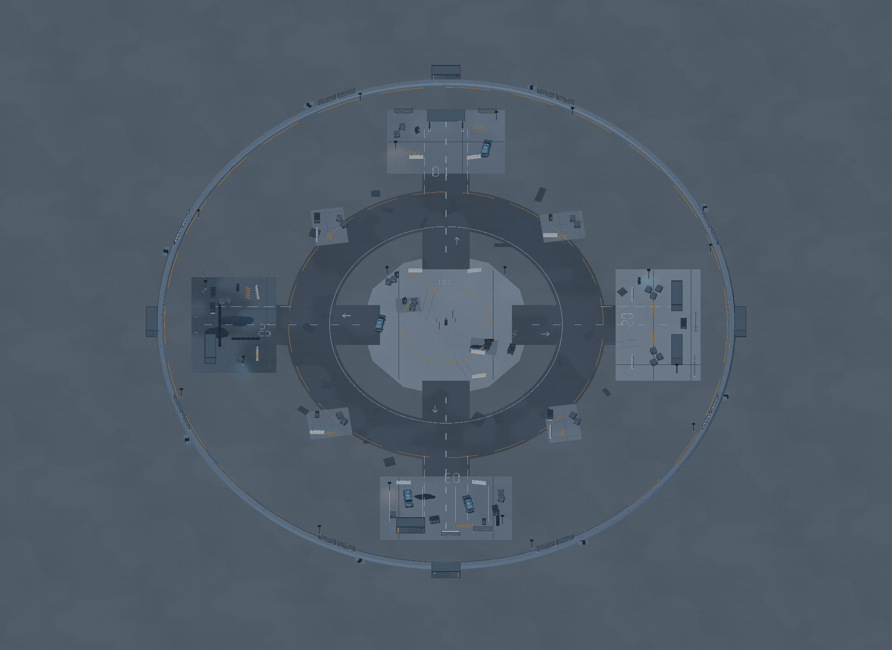
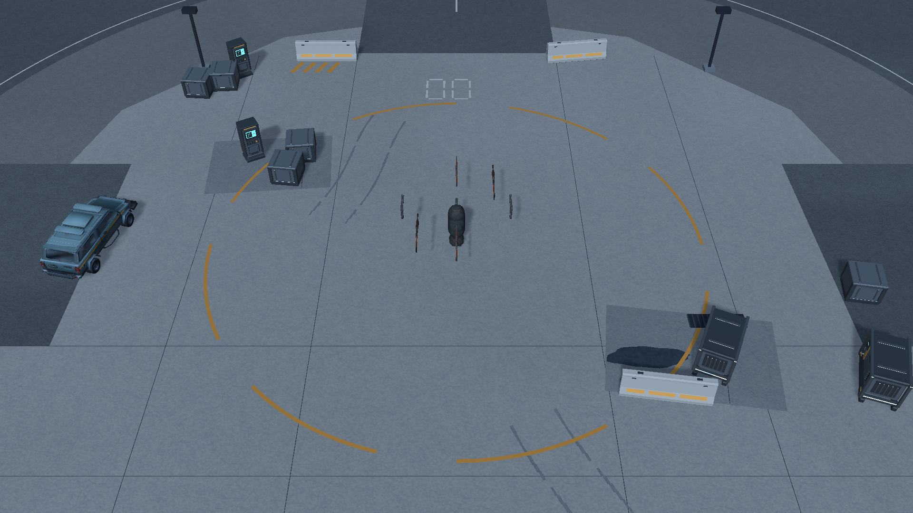
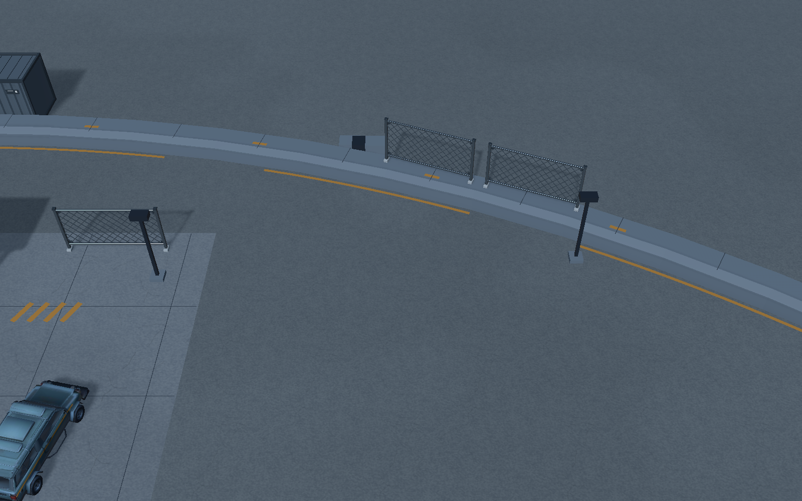
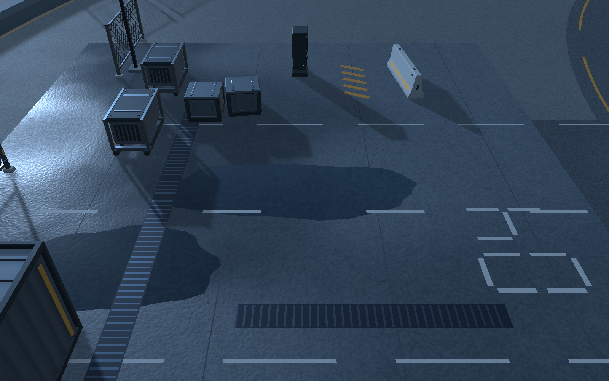

# 120 米回收场 · 蓝灰版完整地图

已从局部样板扩展到完整可玩范围，并落实本轮反馈：连续可见的实体边界、补充中央设备与地面层次、整体转为与玩家身体相近的蓝灰和炭黑。

## 打开与运行

Unity 打开 `Assets/BackpackSurvivor/Scenes/Run/01-Run_ArtFull.unity` 后按 Play，或使用菜单：

`Tools / Backpack Survivor / Art / Open Full 120m Recovery Yard`

这是独立的完整地图预览。正式 `01-Run.unity` 和原 `01-Run_ArtPreview.unity` 保留；本轮没有切换主菜单或发布场景列表。预览 SaveService 停用，避免测试写入正式战绩。角色、敌人、武器、背包、15 分钟单局规则沿用原系统。

## 范围与空间组织

- **MapBounds 半径 60 米、直径 120 米，中心和地面碰撞高度不变。** 核心地板碰撞仍为局部 128×128 米。其世界轴对齐包围盒因场景旋转为约 181×181 米，这不代表地图扩大。
- 中央回收坪增加补给/维修小岛、车辆和设备、分缝、排水盖、轮胎印及 00 区域标记，最靠近中心的障碍包围盒约 7.2 米，保留出生点附近机动空间。
- 10 米宽的环形道路和四条进场路连接检查站、装卸区、维修区、排水区，另有四组过渡设备坪。道路部分外围路障占用少量路肩，应以实际敌群绕行为准。
- 边界改为连续低矮混凝土挡墙，配合围网、反光标、外围货柜与堆料。挡墙名义内沿为 60 米、外沿 61.5 米；96 段直线近似导致内沿最大偏差约 3.2 厘米。
- 挡墙使用 96 个简单盒碰撞；顶部倒角以盒形保守近似。新增棚架只为四根柱子设置碰撞，不把整个棚下空间封死。
- 场外增加无碰撞的 224 米视觉底面，避免边缘游戏镜头看见空白背景。它只增加一个平面，不扩大可玩边界，也没有可探索区域。

## 地面 Shader 与颜色

新增 `BackpackSurvivor/Environment/Recovery Ground`，源码位于 `Art/Environment/VNext/Shaders/RecoveryGround.shader`。它使用世界 XZ 坐标，以米为单位重复纹理，避免大地板拉伸。

两张共享的 512×512 纹理：

| 纹理 | 通道含义 | 导入 |
| --- | --- | --- |
| `Ground_SurfaceMask` | R 颗粒、G 裂缝、B 湿区、A 低频污渍 | Linear、BC7、mipmap、Repeat |
| `Ground_NormalDetail` | RG 编码世界 X/Z 的法线扰动 | Linear、普通 Default 类型、BC7、mipmap、Repeat |

ForwardLit 每个片元使用 **3 次材质纹理采样**：细节掩码、低频掩码、法线。深度法线 Pass 另有 3 次采样；Shadow/Depth Pass 不采样材质纹理。支持 URP 主光级联阴影、Forward+ 额外灯光、PBR 高光、环境光及雾。所有 Pass 共用 UnityPerMaterial 缓冲布局。

沥青、混凝土、旧地坪、修补层、湿地和轮胎痕共享同一 Shader，通过参数改变观感；没有新增透明地面、屏幕反射、细分或视差效果。湿地主要由较低粗糙度、较暗底色和法线变化表现。现有 URP SSAO 配置保留，地板 Shader 自身不额外采样屏幕 AO。

常用调节项位于 `Art/Environment/VNext/Materials/FullMap/`：

| 属性 | 用途 |
| --- | --- |
| `_BaseColor` / `_SecondaryColor` | 大面积底色与颗粒色 |
| `_MetersPerTile` | 实际重复尺寸，当前主要为 4–5 米 |
| `_BumpScale` | 颗粒法线强度，地面细节过硬时降低 |
| `_Smoothness` | 干燥地面的光滑程度 |
| `_Wetness` | 低频湿区对颜色与高光的影响 |
| `_CrackStrength` | 裂缝对比 |
| `_MacroScale` | 污渍重复频率，当前为 0.117 |

新 `SharedKitSteel` 使用独立 16×2 蓝灰色板；车辆材质也加入冷色倾向。原橄榄绿样板色板与预制体不被覆盖。琥珀色警戒标和青色屏幕保留为少量强调色。

## 轻量资源统计

来自最终 Unity 场景及 `unity-fullmap-audit.json`，只统计环境：

| 项目 | 当前结果 |
| --- | ---: |
| 独立 GLB 模型 | 8 件 |
| 八件 GLB 磁盘体积 | 857,316 字节，约 837 KiB |
| 本轮两件新增地标 | 173,804 字节，2,352 三角形 |
| 两张地面 PNG 源文件 | 782,481 字节，约 764 KiB |
| 实例三角形（含地板、标记、边界与装饰） | 118,338 |
| 环境 Renderer / 材质槽 | 246 / 250 |
| 独立网格 / 材质 / 引用纹理 | 128 / 19 / 6 |
| 引用网格内存估算 | 2,460,216 字节，约 2.35 MiB |
| 引用纹理内存估算 | 3,993,887 字节，约 3.81 MiB |
| 合计网格与纹理估算 | **约 6.16 MiB** |
| 局部灯光 | 4 盏，均不投射阴影 |
| 场景投射阴影的灯光 | 1 盏主光 |
| 障碍碰撞 / 核心地板碰撞 | 196 / 1 |

地面为 32 米分块，标线、小装饰按 32 米区域和材质合并，兼顾提交数量与视锥剔除；反复出现的道具共用网格和材质。高分辨率生成源和 Blender 文件继续放在 Unity `Assets` 外。**本轮没有新增 Meshy 付费任务。**

以上内存来自 `Profiler.GetRuntimeMemorySizeLong`，不包含角色、UI、引擎、材质等其他对象，不能当作整个游戏内存或精确显存。材质槽不是实测 Draw Calls；本轮没有据此承诺目标设备帧率。

## 验证

- 最终场景：丢失脚本、网格、材质槽、不支持材质、Shader 编译错误/警告均为 **0**。
- `spawn-coverage.json`：中心和 8 个接近边缘的位置共 **576/576** 次有效生成，越界、生成环带错误、障碍重叠均为 0。
- `boundary-play-check.json`：实际 CharacterController 在 **32/32** 个方向被实体挡墙阻挡；每方向 70 次 Move，实测最大中心半径 **59.606 米**，无越界。探测结束恢复原玩家位置与启用状态。
- `runtime-fullmap-audit.json`：采样时单局运行约 **8 秒**，状态 Running，2 个注册敌人，Console 检查 0 错误、0 警告。验证结束已退出 Play。
- 地面纹理方向与周期接缝检查通过，见 `ground-texture-validation.json`。
- `ground-lighting-day.png` 与 `ground-lighting-raking.png` 使用同一位置，改变主光后可以看到高光、颗粒与阴影响应；测试结束已还原主光。

边界实测与生成覆盖不代替完整 15 分钟敌群压力测试、全路径连接性检查和目标设备帧率测量。

## 可编辑与重建

- `Tools/ArtPipeline/build_ground_maps.py`：生成共享地面掩码和法线。
- `Tools/ArtPipeline/build_fullmap_palette.py`：生成蓝灰色板。
- `Tools/ArtPipeline/build_landmark_modules.py`：生成集装箱与检查棚。
- `Tools/ArtPipeline/Source/Quarantine_Landmarks.blend`：新地标的 Blender 源文件。
- `Editor/FullMapArtBuilder.cs`：重建完整场景、预制体及材质；菜单 `Build Full 120m Recovery Yard`。
- `Editor/FullMapSceneAudit.cs`、`FullMapBoundaryPlayCheck.cs`：资源、生成与边界验证。
- `Editor/FullMapArtCapture.cs`：用临时相机输出实际 URP 画面，保留游戏相机。

重建会重新组装完整预览。手工精修后应先保存为独立场景；构建器遇到未保存状态会另存至 `Scenes/ArtInputSnapshots`。正式原场景 SHA256 仍为 `06A4F25DCCFAA16A88A71809CF941BBE0794872AA3AD303507FC675D20043BA1`。

## 实际画面

