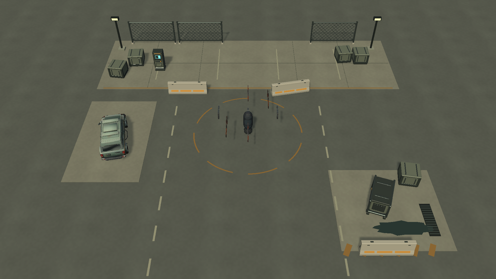
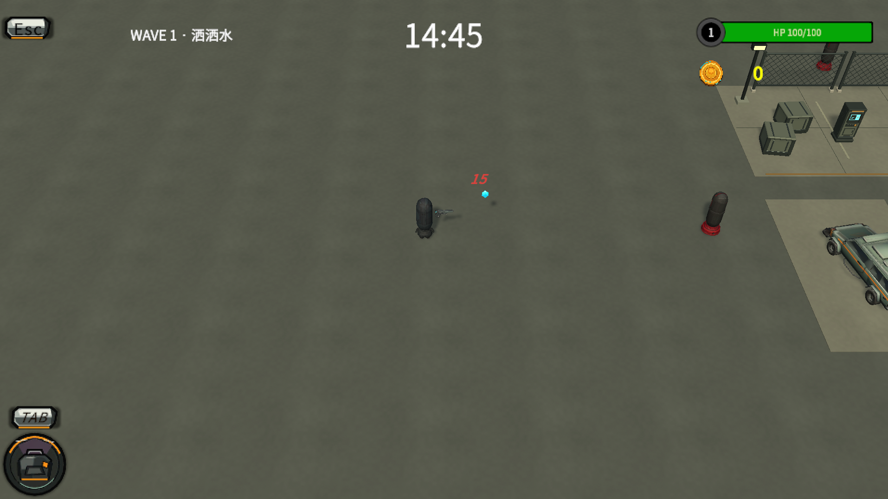

# 封锁区回收站 · 第一阶段实施

本次落实 24×24 米场景样板，供实际游戏镜头和战斗验证。**可玩地图仍为原来的半径 60 米、直径 120 米**；24 米是样板精修范围，不是地图边界。底面为 128×128 米，完整覆盖圆形可玩区域并留出边缘余量。

## 查看和运行

打开 `BackpackSurvivor/Assets/BackpackSurvivor/Scenes/Run/01-Run_ArtPreview.unity`，或使用 Unity 菜单：

`Tools / Backpack Survivor / Art / Open Recovery Yard Preview`

预览场景保留原玩家、武器、敌人、背包和 15 分钟单局系统；按 Play 可直接开始。预览的 SaveService 已停用，避免美术验证写入正式战绩。正式 `01-Run.unity` 没有被覆盖，预览也未加入发布场景列表。

## 已替换内容

- 可平铺沥青底面、混凝土作业坪、道路标线、细尺度地面接缝与小型湿地/排水槽。
- 规范的混凝土路障、完整菱形网围栏、补给终端、货箱与发电机。
- 经过 Meshy 生成和 Blender 比例修正、清理、贴图压缩的回收车辆。
- 柔和主光、灰绿环境光、少量发光指示；未新增实时局部灯光、透明铁网或昂贵后处理。

所有实体道具使用稳定 prefab 根，下面分 `Visual` 与 `Collision`。碰撞采用 BoxCollider，第 7 层 Obstacle；路面标线、水洼、接缝和装饰灯不增加碰撞。

## 轻量资源记录

| 模型 | 源网格三角形 | 材质槽 |
| --- | ---: | ---: |
| 路障 | 456 | 1 |
| 围栏 | 1,024 | 1 |
| 终端 | 1,348 | 1 |
| 货箱 | 904 | 1 |
| 发电机 | 1,716 | 1 |
| 回收车辆 | 3,672 | 2 |
| 合计（六件独立源模型） | **9,120** | — |

六件 GLB 共 **683,512 字节，约 668 KiB**。结构模块共用 16×2 色板，Unity 中统一引用一份 SharedKit 材质；三张实际使用的色板分别承载 BaseColor、Metallic/Smoothness 和 Emission。额外的 Metallic/Roughness 图用于 Blender/glTF 兼容。

车辆仅保留一张 **512×512 JPEG**，移除高分辨率法线、AO、金属度和粗糙度图。地面使用一张 **512×512** 可重复纹理，每 4 米重复；不再拉伸整张地图贴图。

六件 GLB 加五张外部纹理的磁盘体积约 **892 KiB**；这不包含 prefab、Unity 序列化网格、`.meta`、Blender 源文件，也不能当作显存占用。实际活动场景统计由 `unity-scene-audit.json` 记录。

Unity 6000.3.20f1 中的实际环境统计（含 14 个道具实例、128 米底面及标线/装饰）：

| 指标 | 当前样板 |
| --- | ---: |
| 实例三角形 | 16,852 |
| MeshRenderer / 材质槽 | 27 / 28 |
| 独立网格 / 材质 | 19 / 14 |
| 引用网格内存估算 | 1,412,744 字节，约 1.35 MiB |
| 引用纹理内存估算 | 2,878,839 字节，约 2.75 MiB |
| 障碍 BoxCollider | 14 |
| 丢失脚本 / 不支持材质 / 错误障碍层 | 0 / 0 / 0 |

内存数字来自 `Profiler.GetRuntimeMemorySizeLong`，合计约 **4.1 MiB**，只统计环境引用的网格与纹理，不包含引擎、角色、UI、音频、材质或其他系统，也不是目标设备 GPU 显存或帧耗时测试。

标线与地表小装饰已按材质合并，减少单独 Renderer。五类结构道具从多材质改成每件单材质；材质槽数只反映几何提交需求，实际 Draw Calls 还包含阴影与渲染管线 Pass，不能混为一个指标。

高分辨率 Meshy 原始模型和 `.blend` 保存在 Unity `Assets` 外的 `Tools/ArtPipeline/Source`，不作为游戏运行资产导入。Meshy 本轮实际消耗 **15 credits**，凭据仅从环境变量读取。

## 生成位置修正

敌人和宝箱现在通过有限次候选采样检查地图范围、离玩家距离以及障碍占用。越界点直接重采样，不钳制到地图边缘；敌人本次无法找到有效位置时消耗当前生成间隔，避免每帧重试。

沿用当前敌人 20–30 米生成环带、敌人 y=1、宝箱 y=0.5。新增检查只针对 Obstacle 层非 Trigger，不把地板、玩家、敌人或掉落物当成障碍。地图仍为平地，不引入 NavMesh。

## 可编辑源与重建

- `Tools/ArtPipeline/Source/Quarantine_ModularKit.blend`：结构模块源文件，保留原始 8 材质编辑方式。
- `Tools/ArtPipeline/Source/RecoveryCar.blend`：整理后的车辆源文件。
- `Tools/ArtPipeline/build_modular_kit.py`：重建五件模块和色板。
- `Tools/ArtPipeline/prepare_recovery_car.py`：从已有 Meshy 结果整理车辆，运行前阅读脚本参数说明。
- `ArtPreviewBuilder.cs`：创建材质、环境 prefab 和预览场景；菜单为 `Build Recovery Yard Preview`。
- `ArtPreviewAudit.cs`：核验 60 米边界、活动环境面数、材质、内存估算及脚本引用。

重建预览会重新组装样板，手工精修后不要随意重建。若当前场景有未保存改动，构建器先另存到 `Scenes/ArtInputSnapshots`，然后从正式场景重新生成预览，避免覆盖原场景。

本轮完成的是首个场景样板。外围四个主题区与整图美术铺设、角色/敌人重构，仍属于后续阶段；不能用样板的资源数推断整图最终占用。

## 验证记录

- Unity EditMode 实际执行 **12 项，12 通过，0 失败，0 跳过**，耗时 0.767 秒；完整用例摘要见 `spawn-tests.json`。覆盖地图边缘、20–30 米生成环带、障碍体积、非障碍层、Trigger、不可生成区域和重试上限。
- 原场景 SHA256：`06A4F25DCCFAA16A88A71809CF941BBE0794872AA3AD303507FC675D20043BA1`；美术实施未覆盖正式场景。
- 编辑器统计见 `unity-scene-audit.json`，实际 Play 统计见 `runtime-smoke.json`。
- Play 截图采样时单局已运行约 **15.4 秒**，状态 `Running`，注册敌人 4 个；画面可见原角色、枪械、敌人、伤害提示和经验掉落，Console 检查为 **0 错误、0 警告**。另一次原地运行约 15.8 秒后进入原有失败结算，记录保留在 `runtime-smoke-first-run.json`。两次均停用了预览 SaveService，结束后退出 Play。
- 这轮验证不代替整局 15 分钟压力测试、目标设备帧率测试或完整地图美术验收。

## Unity 实际画面

`unity-preview.png` 为保留原游戏镜头的实际场景截图；`unity-gameplay.png` 为 Play 模式画面。早期 `scene-concept.png` 是概念图，不能当成已实现效果。

