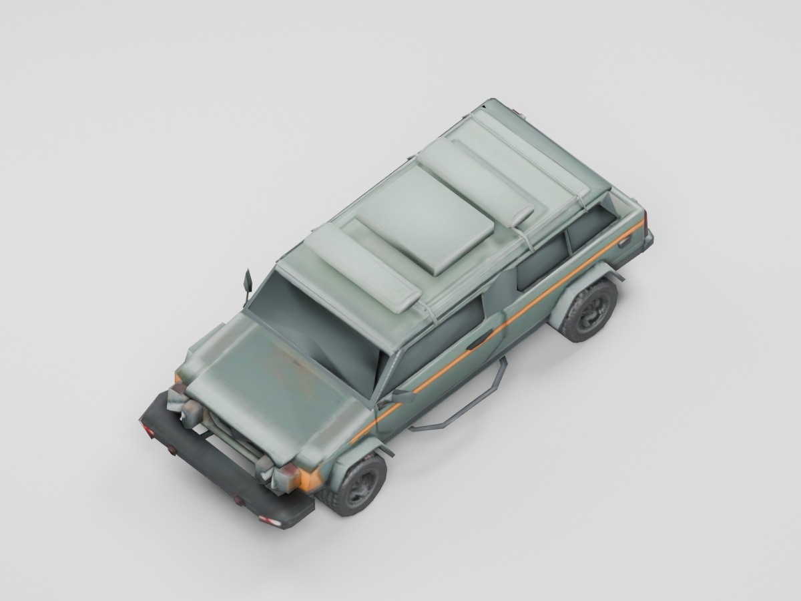

# RecoveryCar · 废弃回收作业车母版

2026-09-08｜阶段 A 样板资产



本资产使用 Meshy 生成一次几何预览、一次材质细化，再由本机 Blender 5.2.1 整理。保留清楚的座舱、引擎盖、四轮与车顶设备，采用灰绿车漆、炭黑玻璃和窄褪色橙色识别条。适合作为回收坪的低矮废弃作业车；首批采用轻损坏母版。

| 项目 | 最终交付 |
| --- | --- |
| 游戏模型 | `BackpackSurvivor/Assets/BackpackSurvivor/Art/Environment/VNext/Models/RecoveryCar.glb` |
| GLB 文件大小 | 275,340 bytes，约 269 KiB |
| 几何 | 3,672 三角形；1 Mesh；2 材质 |
| 游戏贴图 | 1 张 512×512 内嵌 JPEG Albedo；无 Normal、AO、金属度或粗糙度贴图 |
| 尺寸 | 长 4.4m × 宽 1.9m × 高 1.6m |
| 坐标 | 底部中心原点；Unity / glTF +Z 为车头；Blender -Y 为车头 |
| Blender 源文件 | `Tools/ArtPipeline/Source/RecoveryCar.blend`，贴图已打包 |
| 原始生成源 | `Tools/ArtPipeline/Source/RecoveryCar-preview.glb`、`RecoveryCar-refine.glb` |
| 生成记录 | `Tools/ArtPipeline/Source/meshy-car-manifest.json`，仅请求参数、任务 ID、支出与检查数据，无凭据或下载签名 URL |
| Meshy 支出 | 预览 5 credits + refine 10 credits，共 15 credits |

Blender 整理采用分段车长调整，在压缩总体高度时保留约 0.60m 的圆形轮胎和 2.60m 轴距。车窗改用独立炭黑材质，消除 AI 原纹理中显眼的白色反射块；车漆粗糙度固定为 0.82，金属度为 0.10。游戏版从最初约 5.79MB 压缩至约 0.28MB，完整高分辨率生成源只保留在 Tools 中。

最终 GLB 已清空 Blender 场景重新导入检查：边界、底部原点、3,672 三角形和 2 材质一致；唯一内嵌图为 512×512，无缺失图片。正面、背面和俯视预览均由重新导入的游戏 GLB 渲染，而非 Meshy 展示图。碰撞与 prefab 布置由 Unity 样板区整合负责。

本母版的损坏程度较轻，主要作用是替换旧废车塌缩轮廓；后续重损车变体可围绕这份可编辑源增加局部变形。车窗为不透明玻璃，不包含内部座舱细节。

复现整理与导出：

```powershell
& 'E:/Blender/blender.exe' --background --factory-startup --python 'Tools/ArtPipeline/prepare_recovery_car.py' -- --source RecoveryCar-refine.glb --final --rotate-z 90
```

生成流程遵循 [Meshy 官方 Text to 3D API](https://docs.meshy.ai/en/api/text-to-3d) 的 preview → refine 两阶段接口。`meshy_car.py` 从环境读取凭据，只向 `api.meshy.ai` 发送认证请求，并拒绝重复提交已有生成阶段。
