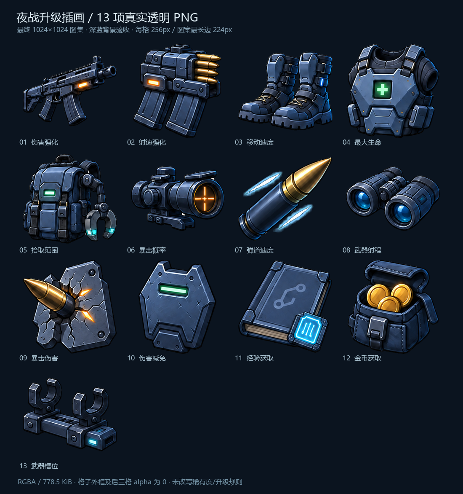
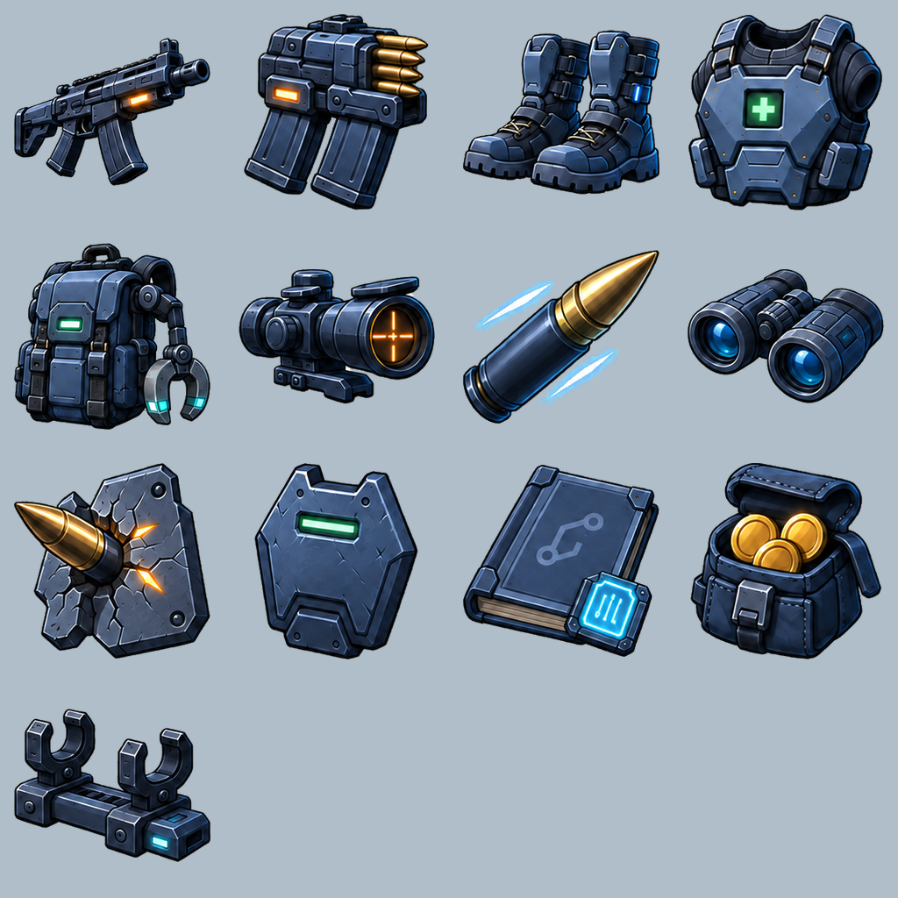

# 升级三选一 / 13 项插画图集

交付图片为 **1024×1024、RGBA8、真实透明背景** 的 4×4 图集，13 个插画占用前 13 格，最后 3 格完全透明。PNG 文件为 **797,206 bytes（778.5 KiB）**。每个图案最长边 224px，单格 256px，四周保留透明间距；Sprite rect 按图案紧边界再加 4px 透明 padding。

图集：`Assets/BackpackSurvivor/Art/UI/Upgrades/UpgradeIllustrations.png`。切分清单：`Tools/ArtPipeline/Source/upgrade-illustrations-manifest.json`，`rect: [x,y,width,height]` 使用 **Unity 左下角坐标系**。不要直接按源图的左上角坐标套用。

| 顺序 | Sprite 名 | 图案 |
|---:|---|---|
| 1 | DamageUp | 战术步枪 |
| 2 | FireRateUp | 加强双弹匣 |
| 3 | MoveSpeedUp | 战术靴 |
| 4 | MaxHpUp | 医疗装甲背心 |
| 5 | PickupRangeUp | 磁吸背包 |
| 6 | CritChanceUp | 精密瞄具 |
| 7 | ProjectileSpeedUp | 加速枪弹 |
| 8 | WeaponRangeUp | 光学望远镜 |
| 9 | CritDamageUp | 击穿装甲 |
| 10 | DamageReductionUp | 防护装甲板 |
| 11 | XpGainUp | 战术记录终端 |
| 12 | GoldGainUp | 金币补给袋 |
| 13 | ActiveWeaponLimitUp | 扩展武器挂架 |

源图为 1254×1254 RGB 插画拼图，棋盘格已经烘焙进 RGB 像素。此次按用户授权进行本地去底、边缘处理和压缩：

- 每个原始格独立切分，避免相邻图案进入 Sprite。
- 根据棋盘底的中性颜色、连通区域与双灰度特征去底，同时清除把手、磁吸环等内部开口里的棋盘。
- 保留金币、子弹、金属倒角及白色发光亮部；不会把所有白色像素一律删除。
- 外轮廓进行窄带反混色处理，再采用预乘 alpha 缩放后转回直通 alpha，减轻浅色边缘。
- 弹速图的两条半透明青色光迹单独按色差恢复 alpha，清理混入光晕的棋盘像素；枪弹本体保留原图。
- RGB 仅压低 1 位精度，单通道最大变化 1/255，alpha 不量化；最终仍为 RGBA PNG，没有改成索引色透明图。

验证结果：13 个 Sprite 名称及 rect 完整，658,305 个像素完全透明，38,319 个像素带中间 alpha。全部 16 格的外侧 12px 带均透明，3 个空格全部透明。深蓝和浅灰两种背景均已目视检查，未见残留棋盘底、白色碎片或跨格图案。

PNG 压缩文件大小不等于运行内存。1024² RGBA8 无 mipmap 的原始像素数据为 4 MiB；Unity 平台纹理压缩后的实际内存由导入设置决定，需以 Unity 审计数据为准。图集共用一张贴图，原图及验收图位于 Unity Assets 外。

可复现脚本：`Tools/ArtPipeline/prepare_upgrade_illustrations.py`。依赖 Pillow、NumPy、SciPy，无在线处理。原始插画保存在 `Tools/ArtPipeline/Source/UpgradeIllustrations-source.png`，manifest 保存源图和最终图集 SHA-256。

```powershell
python Tools/ArtPipeline/prepare_upgrade_illustrations.py
```




