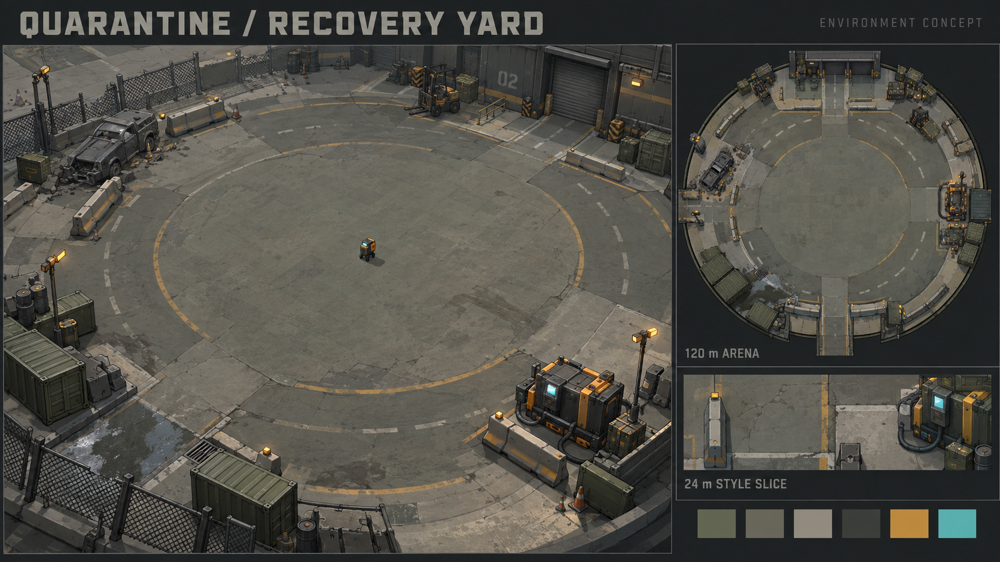
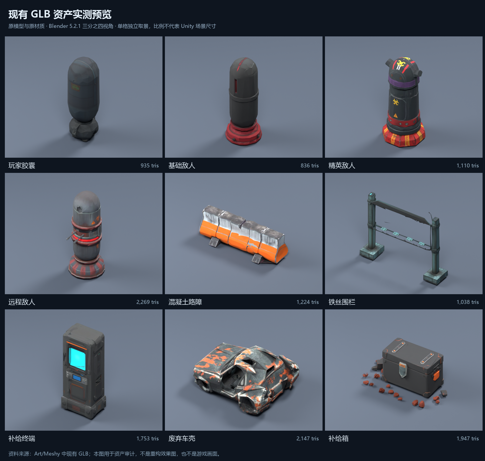
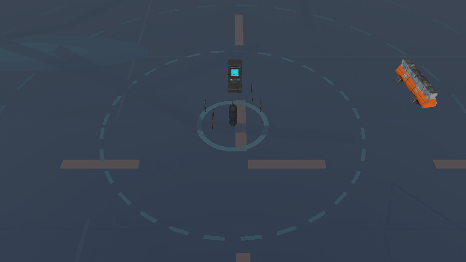

# 背包幸存者 · 场景替换方案

2026-09-08｜范围：场景美术重构提案；角色与敌人列为后续批次。

**建议采用“封锁区回收站”：保留现有工业末日题材与灰绿、炭黑、琥珀橙的识别色，转为体块明确、材质统一、便于俯视阅读的风格化 3D 场景。先完成 24×24 米样板区，再扩展至当前直径 120 米的场地。**

这次提升的重点是地面尺度、场景分区、道具轮廓和光照层次。现有模型已经很轻，继续一味减面不会解决主要观感问题。

## 1. 提案预览

上图由内置 imagegen 根据现有主菜单背景与物品图标风格生成，只表达配色、材质层次、开阔度与外围地标关系；不是 Unity 实机截图，也不是已经完成的模型。图中的全景镜头、圆形构图及“120 m / 24 m”标签不构成精确建模比例。实施以场景配置和游戏相机测试为准，避免机械照搬完整封闭围栏。

现有资产图是本机 Blender 5.2.1 对项目原 GLB、原材质的真实渲染。每格独立取景，大小不能用于比较 Unity 世界尺寸；这也不是当前游戏截图。

此图通过已连接到本项目的 Unity MCP，直接渲染 `01-Run` 的 `Main Camera` 得到。它是编辑状态的场景渲染，未启动单局、未包含 Screen Space Overlay UI，原输出为 957×538；不能作为完整战斗或性能验证。可看到地面大面积近似均匀灰蓝、道路层次较弱，角色偏暗，路障橙色与终端屏幕较显眼。提案优先改善地面层次和主体明暗分离，与实际相机观察一致。

## 2. 项目内容与风格判断

项目目前是 Unity 6000.3.20f1、URP 17.3.0 的 PC 俯视生存射击 Demo。15 分钟单局围绕主动射击、自动武器、敌群追击、经验与金币拾取、宝箱搜刮、背包拼接和构筑展开。场景首先要服务持续走位、目标辨识与掉落阅读。

美术已有可延续的方向：

- **世界观**：灾后封锁区、工业设施、回收装备、污染与失控敌人。
- **UI 与物品图标**：低饱和灰绿/黑色底、大块切面、橙黄色包边，少量青色能源灯；整体偏风格化工业装备。
- **3D 模型**：低面数胶囊单位、工业路障、终端、废车；表面更接近照片式纹理，部分形体有 AI 生成扭曲。
- **当前落差**：图标的轮廓与材质秩序比部分场景模型更清楚。应让环境向现有图标的清晰体块靠拢，并保留后续角色扩展空间。

### 当前工程中的关键事实

| 项目 | 核验结果 | 对替换方案的影响 |
| --- | --- | --- |
| 实际范围 | MapBounds 序列化半径 60m，直径 120m | 旧指南的 40m 半径已过时，不能按 80m 场地重铺 |
| 场景组织 | 手工摆放，无运行时地图生成器 | 适合先建立模块化环境 prefab，再人工布置 |
| 环境实例 | 49 个 GLB 实例：路障 31、废车 8、铁网 6、终端 1、地表 3 | 资产种类少、重复明显，优先做变体和有意义的组合 |
| 镜头 | 透视俯视，FOV 35，跟随偏移 (16,26,-16) | 模型顶面和轮廓重要；以实际镜头验收，不能只看正交展示图 |
| 地面结构 | 大平面下叠放整地板、沥青块、裂纹片 | 尺寸、纹理尺度与层叠关系需要统一整理 |
| 地面实际尺寸 | 84m 整地板放大后 126m；12m 沥青块变 204m；6m 裂纹片变 126m | 小贴片覆盖全场，会把裂纹及纹理粒度拉得过大 |
| 光照 | 地面已接入 Lit；主相机后处理目前关闭 | 灯光与材质响应可以明显改善空间感，后处理应小幅、逐项启用 |
| 导航 | 敌人为局部追击、分离与 SphereCast 避障，无 NavMesh 路径规划 | 使用短障碍与多开口，不宜做长墙、巷道或室内迷宫 |
| 生成 | 敌人围绕玩家 20–30m 生成；宝箱圆内随机；缺少完整障碍排除 | 新增碰撞和外围建筑前要补有效位置检查 |

原始 2048² 地面纹理放到实际 126m 后，名义密度约 **16.3 像素/米**；512² 沥青片拉到 204m 后约 **2.5 像素/米**。这是纹理覆盖比例计算，并非屏幕实测清晰度，但足以说明整张图片拉伸不适合承担全部近景细节。

### 资产质量与性能判断

20 个 GLB 源文件合计约 20,070 三角形；其中 9 个环境源资产仅约 6,172 三角形。此处是“去重源模型统计”，不是场景实例总面数，更不是实测 GPU 开销。

19 个资产各有独立 BaseColor；多数为 768² JPEG。没有法线贴图或金属度/粗糙度贴图，但存在材质参数与颜色，不能据此认定“没有 PBR 材质”。24 个材质有 23 个设为双面，应按需要检查。glTFast 已开启 mipmap、关闭纹理 CPU 可读；尚未实测导入后的显存和平台压缩。

从 Blender 预览可明确看到：

1. 围栏网面缺失或破碎，主体更像空框，建议重新建结构。
2. 废车轮廓塌缩，锈迹对比过强，建议重建一个可靠母版并做变体。
3. 路障与终端基本可辨，可以保留其设计语言，统一材质、尺寸和细节。
4. 胶囊角色与敌人带底座，玩家与基础敌人的形体接近。后续角色重构应处理剪影和阵营辨识。

## 3. 风格选择

| 方向 | 画面特点 | 与当前项目的匹配 | 工作范围判断 |
| --- | --- | --- | --- |
| **A · 封锁区回收站（推荐）** | 灰绿工业地面、混凝土、低矮路障、仓储与维修地标，少量橙色和青色点缀 | 与 UI、装备、现有世界观相容，开放结构适合敌群 | 可分模块制作；较容易逐步替换 |
| B · 简化工业试验场 | 色块更纯、细节更少、场地更抽象 | 当前胶囊单位过渡最自然，可读性高 | 制作量较小，探索感与世界感较弱 |
| C · 感染城区废墟 | 建筑残骸、街道、植被与感染体 | 与背景设定相容，但现有胶囊和 UI 需要更大幅同步 | 建筑、遮挡、路径规划、敌人美术都需扩大投入 |

本轮建议选择 A。B 可作为时间受限时的简化标准；C 适合作为后续独立地图主题，不宜与首次场景替换同时展开。

### A 方向的美术规范

- **造型**：大体块、少量倒角、结构有功能依据；俯视时顶面、轮廓和开口清楚。损坏集中在少数位置，不把整个模型做成碎片。
- **地面**：中等明度、低饱和、低频污渍；通行道路清楚，磨损不形成密集黑色噪点。
- **材质**：区分沥青、混凝土、喷漆金属与湿地。先统一粗糙度和反光，再加细节贴图。
- **颜色**：约 70% 中性灰绿/灰，20% 炭黑与水泥浅灰，10% 以下用于褪色警戒橙和功能色；这是艺术方向比例，不是硬性像素配额。
- **功能色**：环境装饰橙色应偏暗、褪色；掉落金币与稀有装备保留更高亮度。青色灯光只用于小型终端指示，危险提示要同时有形状/边缘特征，避免只依赖红绿色。
- **灯光**：优先阴天或柔和日光，保留接触阴影。先调主光、环境光和材质；再评估轻量色调调整、小范围 Bloom 或 AO。主体区域避免浓雾、深黑阴影与大面积霓虹。
- **视觉高度**：中心区域尽量用低矮物；较高集装箱、门架、建筑外立面放在边缘，并用实际相机检查其投影是否遮住玩家。

## 4. 120 米场地的组织

第一批保持地面平坦和现有范围，用道路、材质切换、设备组合划分空间。分区提供方向记忆，不新增强制任务或交互规则。

| 区域 | 建议位置/尺度 | 视觉组成 | 对战斗的要求 |
| --- | --- | --- | --- |
| 中央回收坪 | 中心约 0–18m 半径 | 褪色回收标记、完整水泥区、稀疏轮胎印 | 出生附近保留大面积清楚的机动空间 |
| 巡回通路 | 约 18–42m，曲线与开口相连 | 沥青路、短路障、少量物资堆 | 至少三条跨区开口，通路约 6–10m 起步，用敌群实测修正 |
| 外围作业带 | 约 42–60m | 检查站、装卸区、维修区、排水角四类地标 | 地标集中摆放，玩家能够绕开；不围成封闭死角 |
| 远景 | 60m 边界之外 | 仓库立面、稀疏灯架、远处废料体块 | 首批作为纯视觉；注意边缘刷怪路径和镜头遮挡 |

四处地标使用不同轮廓和地面材质识别：检查站看门架与路障，装卸区看货柜与箱堆，维修区看废车与设备，排水角看沟槽和小水洼。全场不要均匀撒满道具，也不要用一整圈同款路障作为唯一边界表现。

**边界必须和生成规则一起考虑。** 玩家到 60m 边缘时，当前敌人环形生成可能把敌人放到距中心约 90m 的地方。概念图中的围栏不能直接做成封闭物理墙；应先修正生成点/预留进入路径，再决定围墙碰撞。

## 5. 替换清单与制作顺序

| 优先级 | 资产/系统 | 动作 | 第一批交付 |
| --- | --- | --- | --- |
| P0 | 地面 | 重建组织与材质 | 沥青、水泥、湿地三类基础材质；路标/裂纹/油污/积水/排水口等局部细节 |
| P0 | 路障 | 规范母版与变体 | 完整、破损、端头三型，统一尺寸和吸附规则 |
| P0 | 围栏 | Blender 重建 | 完整与破损两型；规范边框和网面，局部简单碰撞 |
| P0 | 废车 | 重建轮廓 | 一件母版，之后做轻度损坏与颜色变体，减少当前高频橙色锈迹 |
| P0 | 终端/小设备 | 整理或部分重建 | 保留青色屏幕识别，统一材质，去除无用途细碎结构 |
| P1 | 货柜、箱桶、维修设备 | 新增模块 | 少量母版拼出三至四类地标组合 |
| P1 | 外围仓库立面/检查站门架 | Blender 模块拼装 | 一套远景结构，检查游戏镜头遮挡 |
| P1 | 光照与局部效果 | 统一调色 | 柔和日光、接触阴影、小型指示灯，少量环境粒子 |
| P2 | 主菜单背景 | 场景确定后同步 | 用新场景视角或同风格图替换背景；保留菜单功能 |
| 后续 | 玩家、敌人、武器与战利品 | 单独批次 | 场景样板通过后确定角色剪影、阵营色和动画需求 |

小碎石、路面条纹、裂纹、污渍不要分别变成高成本独立 Meshy 模型。优先采用共享贴图、少量网格贴片或项目适用的贴花实现。贴花应有明确尺寸与轻微高度偏移，限制透明重叠；如启用 URP Decal Renderer Feature，再验证目标渲染器配置。

## 6. Meshy、Blender、Unity 的分工

**Meshy 负责不规则单件的形体候选；Blender 负责模型能否规范复用；Unity 负责实际镜头、交互和性能验收。**

| 环节 | 工作 | 输出 |
| --- | --- | --- |
| 形体确认 | 废车、受损设备等先生成无纹理候选；结构件在 Blender 直接建模 | 轮廓正确的母版 |
| Blender 整理 | 清理意外底座/碎片、修复网面、校正尺寸、轴心与法线、处理 UV | 可编辑 .blend 源文件 |
| 材质统一 | 同组资产共享图集/颜色规范，必要时烘焙 BaseColor、Normal、材质掩码 | 已检验的纹理和材质表 |
| 导出 | 应用合理变换，保存明确单位，检查 glTF/GLB 材质结果 | 统一命名的 GLB 与资源说明 |
| Unity 接入 | 保留稳定 prefab 根，把模型放入 Visual；碰撞、交互独立管理 | 环境 prefab、样板场景 |
| 验收 | 在当前透视镜头下看轮廓、重复、遮挡、掉落辨识；测运行性能 | 同机同场景的前后比较 |

Meshy 官方 Text to 3D 文档提供 preview → refine 两阶段流程，适合先确认形状再投入贴图。面数参数会受模型与生成模式影响，不能把提示词中的“low poly”当作达标保证；最终以导出网格实测为准。[Meshy 官方文档](https://docs.meshy.ai/en/api/text-to-3d)

Blender 的 glTF 导出支持金属度/粗糙度材质工作流；程序化节点效果需按导出支持范围处理或烘焙，不能假设 Blender 中所有节点效果都会原样进入 Unity。[Blender glTF 官方手册](https://docs.blender.org/manual/en/4.0/addons/import_export/scene_gltf2.html)

### 提供给 Meshy 的单件造型提示示例

以下为尚未提交的候选提示；生成后仍需检查，不能保证仅靠文字排除所有错误。

**废车母版**

> A single abandoned compact utility vehicle shell for a stylized top-down industrial survival game. Recognizable cabin, hood and four wheel positions; believable vehicle proportions, intact readable silhouette. Chunky hard-surface forms, broad panels, limited localized dents, no flattened body. Desaturated charcoal paint, sparse muted rust, low visual noise. No ground plane, no pedestal, no surrounding debris, no people, no text. One isolated prop, separate logical parts where possible, clean game-ready topology.

**维修设备母版**

> A single compact industrial field generator for a stylized top-down quarantine recovery yard. Large readable metal housing, reinforced corners, one small recessed service panel, two clear vent areas. Broad beveled shapes, practical construction, restrained wear. Muted olive and charcoal painted metal, one faded amber panel, tiny cyan status light. No cables spreading onto the ground, no pedestal, no environment, no text, no people. One isolated prop with a clear flat bottom.

尺寸由 Blender 精确设定，不能依赖生成结果的自动尺寸。路障和围栏应在 Blender 中按规格制作，不必经历 AI 生成再反复修结构。

### 初始制作预算

以下是样板阶段的目标范围，不是项目已经达成的性能数据，也不要求现有低面数资产为了凑预算增加面数。

| 类别 | 每件建议三角形 | 材质/贴图原则 |
| --- | ---: | --- |
| 重复路障、围栏、箱桶 | 200–1,200 | 一材质，尽量共用 1K–2K 图集 |
| 废车、终端、维修设备 | 1,000–4,000 | 一至两材质，轮廓优先 |
| 外围门架、仓库立面等 | 3,000–10,000 | 模块复用；视距需要时做简化版本 |
| 地面 | 简单网格即可 | 1K–2K 可平铺材质，初始细节密度约 128–256 px/m，再按游戏镜头调整 |

所有新资产明确标注米制尺寸、轴心与前向；模型局部底面归零，新环境 prefab 根尽量保持单位缩放。游戏世界高度以现有地面碰撞和控制器为准，不在美术替换时顺手归零玩家根节点。

## 7. 实施阶段与验收门槛

### 阶段 A：24×24 米视觉样板

复制运行场景为 `01-Run_ArtPreview`，保留原相机、玩家、敌人、HUD 与战斗系统。只替换一段地面、两组路障、一段围栏、一个终端和一辆车；加入适量道路标记。记录原图与样板在同一游戏镜头下的对比。

通过条件：中央战斗地面安静，玩家与普通敌人能辨认，经验与金币不淹没在路标和污渍中，背包打开时仍能阅读环境；透视顶面没有明显 AI 扭曲；角色周围没有高物遮挡。

这一阶段是决定是否扩展整图的评审点。建议预算先放在这五类样板资产，避免尚未确认风格就批量生成整套模型。

### 阶段 B：环境资源封装

新增 `Art/Environment/VNext/` 和相应环境 prefab 目录；保留旧资源与 `.meta`。稳定 prefab 根下分开 `Visual`、`Collision` 和按需保留的交互锚点。改模型时只替换 Visual，不依赖 GLB 内部节点承担长期脚本绑定。

清理拉伸地表的组织方式，建立世界尺度一致的平铺材质和局部贴片。稳定后再逐组迁移原场景内容，保留可回退版本。

### 阶段 C：铺设全图与必要接入修正

沿用 120m 场地，按四个外围主题组合铺装。大障碍间保留充分开口，同时给敌人和宝箱生成增加边界/占用检查、有限次数重试与失败降级，防止位置搜索无限循环。

沿用现有局部避障时，不新增长连续墙或封闭内部空间；如果后续确实需要街巷或室内玩法，再单独规划导航。

### 阶段 D：实际运行验收与正式切换

- 用同一机器、相同分辨率、相近波次和敌人数比较；至少检查 1600×900 与 1920×1080 的主体可读性。
- 跑中心、路障夹角、车阵、边缘各处；覆盖宝箱与敌人生成、远程弹道、掉落拾取与背包开关。
- 在 Development Build 中比较 CPU/GPU 帧时间、P95 帧时间、批次数和纹理内存；初始目标为相同负载下 P95 不恶化超过约 10%，再依据基线和目标硬件确认预算。60 FPS 对应 16.67ms，仅在原基线支持时作为目标，不用 Editor 截图承诺帧率。
- 完成一局 15 分钟验收，并测试失败、重开、返回主菜单，确认引用与状态正常。
- 最终切换仍保持正式 `01-Run` 场景身份，或同步所有按名称加载的入口；预览场景不要误入发布列表。

## 8. 接入时必须保留的边界

| 现有约束 | 实施要求 |
| --- | --- |
| 路障/车/围栏碰撞直接加在 GLB 实例根的 scene override | 迁移前记录 Layer、尺寸和引用，建立稳定 prefab 壳后再换模型 |
| Projectile 扫描所有层，碰到非 Trigger 即回池 | 装饰物默认不加碰撞，避免小碎石、灯具或贴片意外挡子弹 |
| Obstacle 为第 7 层，部分由 GLB 导入设置提供 | 新 prefab 显式核对层，不能只凭物体名字判断 |
| 玩家根 y=-4，CharacterController 中心 y=5.06 等已有补偿 | 本轮保持控制器根、武器挂点和世界高度，避免把模型校正变成运动逻辑改动 |
| 玩家移动方向代码依赖 -45° 相机偏航 | 不把换相机角度作为纯美术小改；若调整，需同步运动验证 |
| HazardZone 有代码，但当前场景未发现组件实例 | 污染外观先明确是装饰；未接触发器前不宣称有危险区玩法 |

## 9. 后续角色与敌人方向

场景样板通过后，建议角色延续“工业回收单元”的粗体块语言。玩家可用背包、肩部装备和清晰朝向建立剪影；普通敌人、远程敌人、精英使用不同宽高比和武器轮廓。配色只作第二层提示。

第一轮角色改造可以沿用控制器和现有动作逻辑，先去除无用途底座，解决敌我轮廓过近、朝向不清、顶部颜色过暗的问题。若要加入完整人形骨骼和动作，应先明确移动/瞄准/开火/受击的动画需求，再决定绑定；当前这些 GLB 没有骨骼和动画。

场景先完成，角色后接入，可以在同一光照与真实战斗距离下评审角色，而不必同时猜两套风格是否相容。

## 10. 证据索引与交付范围

本方案依据当前工作区文件、GLB 二进制统计、原资源图片、Blender 实际渲染及 Unity MCP 的场景层级与主相机渲染。未以旧版本文档覆盖当前场景序列化值。MCP 接入已完成，实际验证状态见 [连接记录](unity-mcp-connection.md)；场景效果的最终结论仍需阶段 A 的 Unity 实机样板。

| 证据 | 位置 |
| --- | --- |
| 当前引擎与包版本 | `BackpackSurvivor/ProjectSettings/ProjectVersion.txt`、`BackpackSurvivor/Packages/manifest.json` |
| 60m 半径、地图根 | `01-Run.unity:13241`、`:13223` |
| 透视镜头与跟随 | `01-Run.unity:4541`、`:4593`、`:8320` |
| Ground 与整地板缩放 | `01-Run.unity:11816`、`:14972` |
| 敌人实际生成环带 | `01-Run.unity:17206` |
| 局部避障 | `Scripts/GamePlay/Enemies/AI/EnemyMovement.cs:82`、`:142` |
| 敌人/宝箱生成点 | `Scripts/GamePlay/Waves/EnemySpawner.cs:38`、`Scripts/GamePlay/Loot/Chests/ChestSpawner.cs:50` |
| 子弹碰撞行为 | `Scripts/GamePlay/Combat/Projectiles/Projectile.cs:98`、`:132` |
| 玩家补偿位移 | `01-Run.unity:16276` |
| 美术生成记录 | `Art/Meshy/Meshy_FirstBatch_Final_Manifest.json` 与各资产 manifest |
| 旧指南 | `Art/Meshy/MapModules/MapModules_PlacementGuide.md`、`FloorSet/FloorSet_PlacementGuide.md` |

表中场景位于 `BackpackSurvivor/Assets/BackpackSurvivor/Scenes/Run/`，Scripts 与 Art 均位于 `BackpackSurvivor/Assets/BackpackSurvivor/`。行号按本次检查版本记录。

交付文件：`scene-replacement-plan.md`、`scene-concept.png`、`current-assets.png`、`current-unity-camera.png`、`scene-concept-prompt.txt` 和 `unity-mcp-connection.md`。本轮提供方案与视觉提案，并按用户后续要求接入 Unity MCP；未将提案资产替换进正式场景，也未提交 Meshy 付费生成任务。
