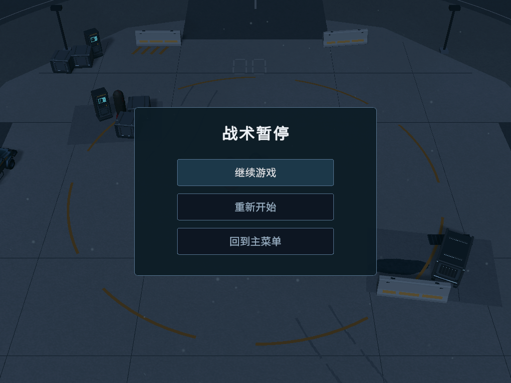
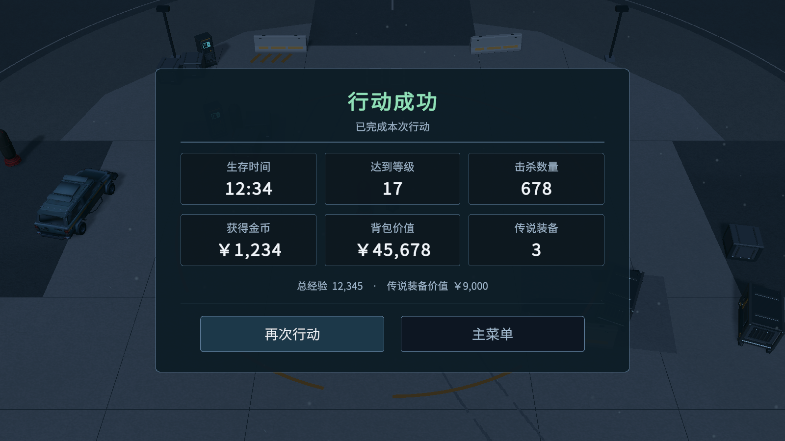
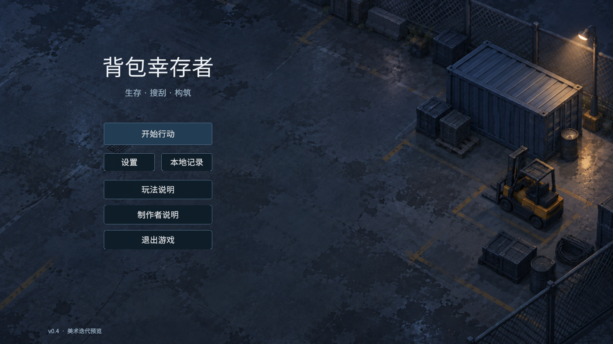

# v0.4 美术迭代实施记录

2026-09-08 至 09-09。状态：**已接入项目、完成 Editor 功能与视觉验证，未发布 Windows 包**。

[完整方案与迭代范围](../../V0.4美术重构与迭代方案.md)

## 已实施

| 内容 | 落地方式 |
|---|---|
| Run HUD | 左上血量/等级/经验，上中时间/波次，右上金币/最近补给；下方背包与暂停按钮，保持战斗中心通透 |
| 背包 | 生图包边处理成透明九宫格 Sprite；6×8、420×560、70节距保持不变，外框开口精确贴合；复用原物品图标与稀有度，统一 Tooltip |
| 装备掉落 | 五级白/绿/蓝/紫/红细光柱与软底环；观察原飞行碰撞器状态，落地显示、取回池清空，不加 Light/Particle/Collider |
| 暂停 | Esc 或 HUD 按钮打开，继续、重开当前场景、回到主菜单；无默认焦点，方向键主动选择后可 Enter 提交 |
| 结算 | 复用 RunResult，六项统计和经验/传说价值补充信息；胜负色、再次行动与主菜单按钮 |
| 主菜单 | 生图夜间回收场背景；统一按钮、设置/记录/说明面板，弹窗打开时隐藏下面的菜单文字和按钮 |
| 场景收尾 | 6份地面材质独立副本降低裂纹和标线对比；沿用原场地布局、边界障碍、宝箱与夜间粒子 |
| 场景入口 | MainMenu 的开始目标配置为01-Run_ArtFull；重开使用当前场景。Build Settings追加ArtFull，保留原01-Run |

## 实机截图

所有下列图片均由 Unity Game View 正常帧截图，非设计稿叠图。背包物品采用现有数据表中选出的预览装备；结算胜负预览使用固定 RunResult 样本检查六个字段，图中的12:34不代表修改了15分钟胜利条件。真实结束、再次行动和返回主菜单链路另行验证。

- [五级装备光柱](Screenshots/rarity-beacons-refined.png)：原装备色球保留，新增细光柱/软底环；本图来自材质参数确认阶段，HUD文字随后统一了Canvas配置。
- [升级三选一与新HUD遮挡](Screenshots/upgrade-v04.png)
- [1024×768背包](Screenshots/inventory-1024x768.png)、[1024×768结算](Screenshots/result-defeat-1024x768.png)
- [设置](Screenshots/main-menu-settings.png)、[记录](Screenshots/main-menu-records.png)、[玩法说明](Screenshots/main-menu-guide.png)
- [生图视觉方向稿](ui-art-direction.png)是实现参考，不是游戏截图。

## 资源控制

- 新增两张图片：背包512×664、主菜单1024×576，PNG合计992,423 bytes；Standalone实际导入为BC7、无mipmap、不可读。
- 两张图片的BC7像素载荷合计**908 KiB**，另复用1×1白像素填充。该数字不等于总显存；包含Unity对象开销的实测记录见 [texture-runtime-audit.json](texture-runtime-audit.json)。既有中文字体及13项升级插画继续共用。
- 光柱每件8顶点/4三角形，共5个材质、0纹理、0新增灯光/粒子。更高稀有度略高、略宽；不增加新对象池，不承诺固定draw call或FPS提升。
- 生图原始大图、方向稿及处理脚本放在Assets以外，游戏仅引用处理后的轻量资源。
- [完整资源说明](asset-resource-budget.md)、[光柱资源实测](loot-beacon-resources.json)、[包边切片数据](inventory-frame.md)。

## 代码范围

对实施前保存的66份GamePlay/Inventory/Core代码逐文件比对：**64份逐字节相同，仅2份含获准的小接线改动**。GameSession只将原PauseRun/ResumeRun改为public；DropItem只增加可空视觉引用与初始化/回池钩子。伤害、波次、概率、背包放置/合并/邻接、对象池和存档算法没有改写。

现有Presentation层仅修改MainMenuController的目标场景配置、ResultView的统计排版绑定/按钮、InventoryUIController的暂停/结算开包早退；新增HUD遮挡、暂停菜单、背包外观/提示框边界、掉落光柱等纯展示组件。场景和Prefab重绑由Editor构建器完成。

[保护审计与准确差异](core-code-protection.md)、[地图几何保护审计](map-preservation-audit.md)。Git工作区原本已有上轮场景改动，因此保护核对以本轮开始的hash快照为准，不把全部未提交改动都归到本次。

## 验证结果

| 检查 | 结果/证据 |
|---|---|
| Unity编译、运行及停止后原生控制台 | 0错误、0警告；[final-editor-audit.json](final-editor-audit.json) |
| 原6×8、48格、物品原点和框开口 | 最终通过；[inventory-ui-audit.json](inventory-ui-audit.json)最后记录 |
| 原控制器拖拽、4次旋转、合法放置、两物品合并 | 通过；测试探针自动清理，原库存引用恢复 |
| 稀有度池复用/飞行结束 | [pool](loot-beacon-pool-validation.json)与[flight](loot-beacon-flight-validation.json)均通过 |
| 实际拾取→背包面板外丢弃→落地→再次拾取 | [roundtrip](drop-roundtrip-finish.json)通过；等级、稀有度、尺寸和基础价值保持 |
| 初次升级无焦点、方向键、数字键、重复提交、Tab | 真实XP事件/正常InputSystem帧处理通过；[upgrade-input-audit.json](upgrade-input-audit.json) |
| Esc暂停、下方向键、Enter继续、Esc再次开关 | [pause-keyboard-audit.json](pause-keyboard-audit.json)通过；设备已恢复 |
| Running/Paused/升级/Victory/Defeat显示与输入隔离 | 各ui-state报告passed=true；暂停/结算时Tab不改变隐藏背包；预览结束游戏数据恢复 |
| 真实胜负UI、结算重开、暂停重开/主菜单、菜单再次开始 | 使用实际按钮完成；[再次开始](main-menu-start-route.json)确认为ArtFull、Running、timeScale=1、6×8已初始化 |
| 1600×900、1024×768 | 运行画面检查；修复旧Canvas Gamma设置造成的SDF文字发粗及旧Tooltip stretch锚点 |
| 存档/测试状态 | 原存档逐字节恢复，虚拟键盘移除、物理输入与后台运行设置恢复，退出Play且场景已保存 |

审计日志保留了过程记录：第一次空背包检查因没有实际物品未满足测试前提，后续放入真实数据表物品通过；编辑器测试脚本在Play中热重载导致非序列化运行状态丢失，停止后完成统一编译，再全新进入Play完成最终0错误检查。未为这些测试环境现象改写玩法代码。

Windows独立包15分钟完整单局、密集掉落GPU性能、更多显示比例仍作为发布前验收；本轮未生成或发布新安装包，不将Editor检查描述为发布验收。邻接算法以源文件未改及原重绘流程继续执行为依据，本轮未重新穷举全部邻接组合。

## 复现与继续开发

直接打开 `Assets/BackpackSurvivor/Scenes/MainMenu/MainMenu.unity` Play，或打开 `Scenes/Run/01-Run_ArtFull.unity` Play。

要重新应用本轮视觉：在ArtFull场景、非Play状态执行菜单 `Tools/Backpack Survivor/Art/V0.4/Apply Complete Art Iteration`。主菜单通过Editor方法 `V04ArtIterationBuilder.ApplyMainMenu()`更新。构建器先保留未保存的场景快照；不要在Play中改脚本再把热重载现场作为正常新局测试。

若以后执行旧FullMapArtBuilder从原01-Run整体重建地图，再执行本轮Complete Art Iteration；旧地图构建器本身不会自动带入本轮UI。

后续可单列角色/敌人模型重构、背包旧图标补齐与密集掉落性能工作。本轮未引入这些内容或新玩法。
