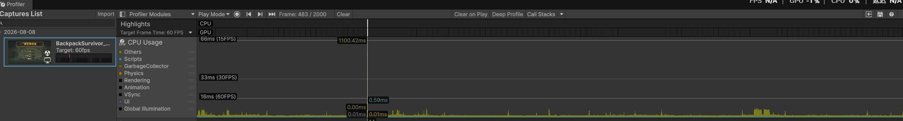
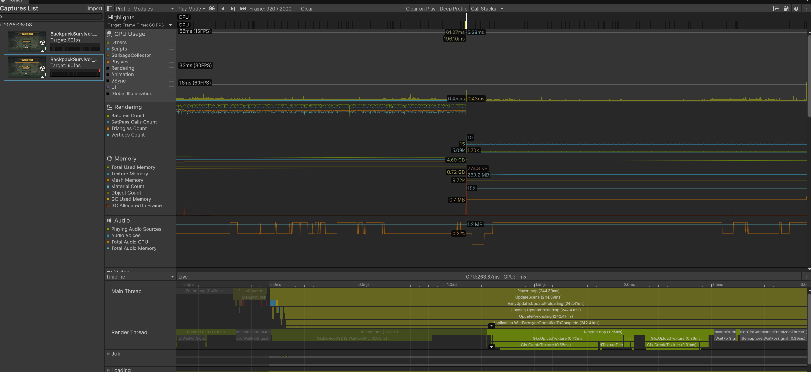
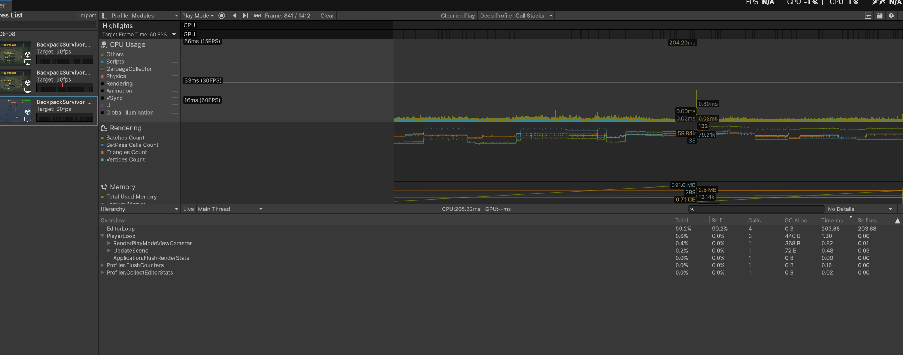
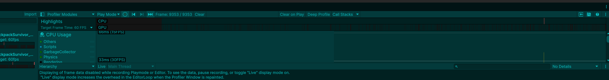
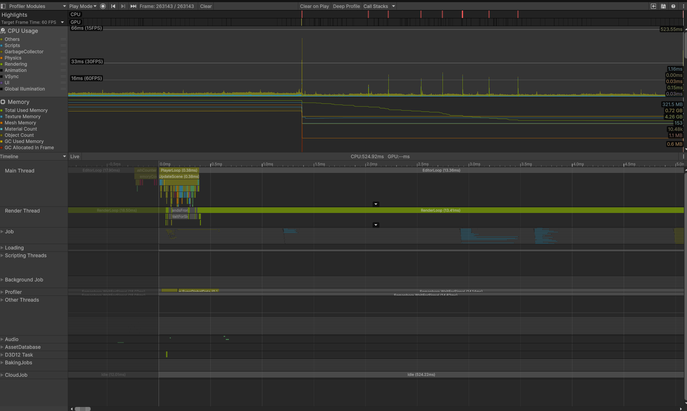
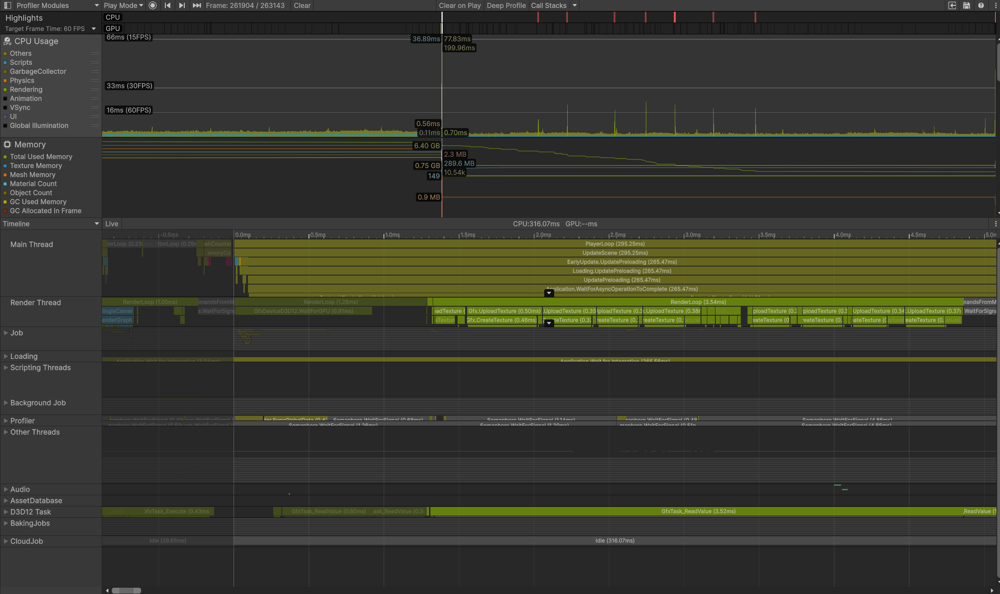
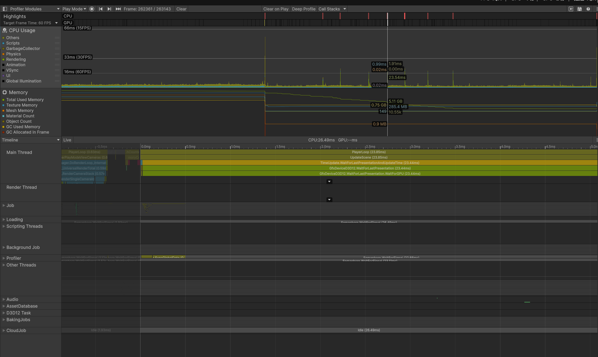

# Profiler 快扫证据包

> 日期：2026-08-08  
> 对应阶段：v0.2 打包前性能验证  
> 用途：保留轻量截图证据，证明本项目在 Demo 打包前做过 Unity Profiler 快扫与 Build 实测验证。

---

## 证据 1：Editor 中出现 Render Thread 尖刺

- 现象：Profiler 图上出现约 `1100ms` 级别尖刺。
- 判断：该截图只能证明 Editor/Profiler 观测期间出现过大尖刺，不能直接等同于 Build 中游戏逻辑卡顿。
- 处理：不立刻改玩法代码，继续切到 Timeline / Hierarchy 查线程来源。

---

## 证据 2：Loading / Texture Upload 尖刺

- 现象：CPU 约 `263.87ms`，Main Thread 中 `PlayerLoop` 约 `244.39ms`。
- 关键调用：`EarlyUpdate.UpdatePreloading`、`Application.WaitForAsyncOperationToComplete`，Render Thread 可见 `Gfx.CreateTexture` / `Gfx.UploadTexture`。
- 判断：这更像资源预加载、贴图上传、字体/界面首次展开导致的加载尖刺，而不是敌人 AI、子弹、掉落、背包重绘等每帧脚本热点。
- 处理：列入观察，不做大重构；若 Build 里复现，再考虑 UI/TMP/贴图预热。

---

## 证据 3：EditorLoop 占用证明观察开销

- 现象：CPU 约 `205.22ms`，Hierarchy 中 `EditorLoop` 占 `99.2%`，`PlayerLoop` 仅约 `1.30ms`。
- 判断：这一帧的主耗时来自 Editor，而不是游戏运行逻辑。
- 处理：不能基于这类帧去改玩法代码；必须用 Development Build + Autoconnect Profiler 或直接 Player Build 体验验证。

---

## 证据 4：Live Display 提示 Profiler 本身增加开销

- 现象：Profiler 显示提示：录制 Playmode/Editor 时帧数据展示受限，Live display 会增加 Profiler Window repaint 带来的 EditorLoop 开销。
- 判断：这解释了为什么 Editor 中会看到非游戏逻辑的尖刺。
- 处理：最终结论以 Build 体验为准。

---

## V0.3 快扫补充：发布前性能闸门

> 日期：2026-08-20  
> 对应阶段：v0.3 发布前快扫  
> 结论：没有发现需要阻断 v0.3 Build 的持续脚本热点；可见尖刺主要来自资源预加载、贴图上传、GPU 等待或 Editor/Profiler 观察成本。

### 证据 5：大部分普通帧 PlayerLoop 很低

- 现象：选中帧中 `PlayerLoop` 约 `0.38ms`，主要可见耗时并不集中在 Gameplay 脚本。
- 判断：这类帧说明常态运行并没有明显 CPU 脚本瓶颈。
- 处理：不因少量 Editor 尖刺直接重构战斗、敌人或背包系统。

### 证据 6：Loading / Texture Upload 仍是尖刺来源之一

- 现象：尖刺中可见 `EarlyUpdate.UpdatePreloading`、`Loading.UpdatePreloading`、`Application.WaitForAsyncOperationToComplete`，Render Thread 可见 `Gfx.UploadTexture` / `Gfx.CreateTexture`。
- 判断：这更像资源预加载、贴图上传或首次使用资源造成的尖刺，而不是敌人 AI、远程敌人、子弹或背包逻辑持续变慢。
- 处理：记录为后续资源预热和贴图整理方向，v0.3 发布前不做大重构。

### 证据 7：WaitForLastPresentation / GPU 等待帧

- 现象：选中帧主要耗时落在 `WaitForLastPresentationAndUpdateTime` / `WaitForGPU` 一类等待上。
- 判断：这类帧更偏渲染呈现或同步等待，不应直接归因于 Gameplay 脚本卡顿。
- 处理：如果后续 Build 中出现稳定掉帧，再用 Development Build + Player Profiler 验证 GPU、材质、光照和批处理方向。

---

## 最终结论

- v0.2 Build 实测：后期波次打到约 `6000` 分，没有明显卡顿，也没有几秒一顿的现象。
- v0.3 Build 实测：新增升级池、构筑效果、音频、远程敌人、设置和存档后，正式包试玩仍未出现阻断性卡顿。
- 性能结论：当前 Demo 不存在阻断打包的 CPU/GC 卡顿问题。Editor 中的部分尖刺主要来自资源加载、贴图上传、GPU 等待或 Profiler 观察开销。
- 已修复的 Build 差异：v0.2 期间子弹与装备掉落物颜色异常，根因是运行时 `CreatePrimitive` 依赖默认材质，已在 BUG-025 中修复为显式 URP Unlit 材质 + `MaterialPropertyBlock`。
- 仓库策略：提交本目录轻量 PNG 和说明文档；不提交 `BackpackSurvivor/ProfilerCaptures/` 中的大体积 `.data` 原始捕获文件。
