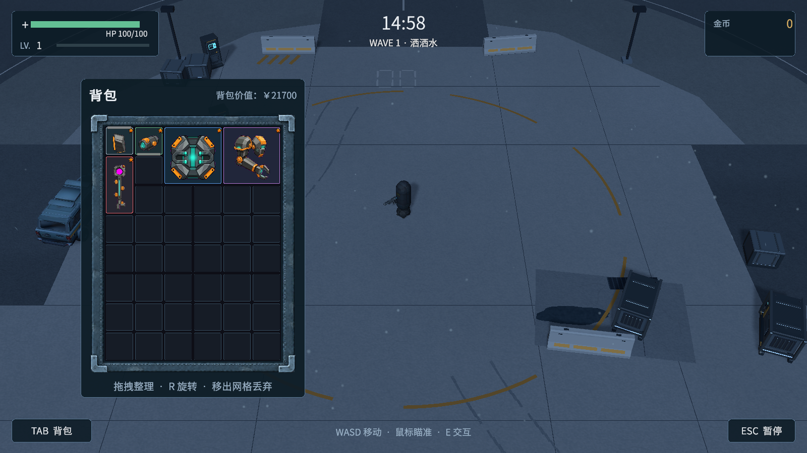

# Backpack Survivor / 背包幸存者

> Unity 3D 俯视角生存射击 Demo。玩家在 15 分钟单局中移动、射击、搜刮、整理背包，并通过武器激活、合并升级、邻接芯片、局内成长和本地纪录形成构筑循环。


## 项目概览

《背包幸存者》是一款个人 Unity 3D 俯视角生存射击项目。项目融合幸存者战斗、掉落搜刮、网格背包构筑、合并升级、邻接联动、升级三选一、波次压力、金币与物品价值结算，在15分钟单局中呈现“边战斗、边搜刮、边整理构筑”的核心体验。

当前 v0.3 已经完成 Windows Build 验收：在 v0.2 完整闭环基础上，进一步补充了升级候选池、更多背包构筑效果、内容池扩展、基础音频与 BGM、设置菜单、敌人群体移动优化、远程敌人波次混编和本地存档纪录。

当前工作区已接入 **v0.4 美术重构阶段成果**：在前期夜战地图、五级宝箱和升级插画 UI 的基础上，统一 HUD、背包、装备稀有度光柱、暂停、结算与主菜单。这里记录的是 v0.4 的美术与展示接线子阶段，**不是 v0.4 全部内容，也不是正式发布说明**；v0.4 尚未打包发布，下载版本仍为 v0.3。查看 [迭代方案](Docs/V0.4美术重构与迭代方案.md) 和 [实施记录、游戏画面与资源预算](Docs/ArtDirection/V0.4/README.md)。



上图为当前工作区的 Unity Game View 截图，背包示例装备取自现有数据表；不是已发布 v0.3 的画面。

## 试玩下载

Windows 可试玩包发布在 GitHub Releases：

- [下载 Backpack Survivor v0.3 Windows Demo](https://github.com/cpz66l/BackpackSurvivor/releases/tag/v0.3.0)
- [观看项目展示视频](https://t.bilibili.com/1234504825008291859?share_source=pc_native)

下载后请先解压整个压缩包，再双击 `BackpackSurvivor.exe` 启动。不要只单独运行 exe，游戏还需要同目录下的 `BackpackSurvivor_Data`、`UnityPlayer.dll`、`MonoBleedingEdge` 等文件。

## 当前版本

| 维度 | 状态 |
| --- | --- |
| 已发布版本 | v0.3 Windows Demo；已完成独立运行验收 |
| 当前工作区 | v0.4 美术重构子阶段；Editor 验证完成，未打包发布 |
| 版本节点 | 2026-07-19开始；2026-08-20完成v0.3 Build验收；2026-09-08至09-09完成本轮美术接入与Editor验证 |
| 主要入口 | `Assets/BackpackSurvivor/Scenes/MainMenu/MainMenu.unity` |
| 当前单局场景 | `Assets/BackpackSurvivor/Scenes/Run/01-Run_ArtFull.unity`；原`01-Run`保留 |
| 单局目标 | 15 分钟生存、成长、搜刮与结算 |
| v0.4发布前待验收 | Windows独立包完整单局、密集掉落性能与更多显示比例 |

开发过程中使用 AI 辅助方案设计、代码实现与审阅、调试、Unity接线、自动化验证和美术制作；作者持续负责需求取舍、视觉确认与实际试玩反馈。相关资产来源和处理方式见下文，不将AI参与的实现或生成素材描述为全部手工独立完成。

## v0.4 美术重构范围

本节只说明此次 v0.4 美术重构已经覆盖的画面、资源和最小展示接线边界；它不等同于 v0.4 的完整更新清单。后续玩法扩展、数值内容、角色/敌人模型重构、Windows 独立包验收和正式 tag/release 仍需另行完成。

| 模块 | 当前工作区内容 |
|---|---|
| 地图与氛围 | 原120m夜战回收场、可见边界障碍、中心道具、与灯光交互的地面纹理Shader；局部风尘和细雨 |
| 宝箱与升级 | 五级宝箱外观保留主要稀有度颜色；升级UI使用5类13项独立插画、共享图集、初始无默认焦点 |
| HUD与背包 | 血量/等级/经验、时间/波次、金币/补给提示集中排布；蓝灰包边、格子和物品原点对齐，统一Tooltip |
| 世界装备 | 白/绿/蓝/紫/红稀有度光柱与软底环，散落时隐藏、落地显示、回池清理 |
| 暂停与结算 | 暂停提供继续、重开当前地图、主菜单；结算复用原统计快照，展示六项统计及补充信息 |
| 主菜单 | 夜间回收场背景，统一按钮、设置、记录和说明面板；开始目标配置为ArtFull |

本轮限定为美术和必要的展示接线：地图可玩半径仍为60m，地图层级、几何和碰撞保持；背包仍为6×8、420×560交互区域。伤害、波次、概率、经验门槛、放置/旋转/合并/邻接、对象池和存档算法没有重写。当前角色与敌人模型保留，后续重构另列任务。

轻量化采用共享材质/网格、低分辨率贴图、无mipmap UI资源和局部效果。新增两张UI图片为512×664、1024×576，Windows BC7像素载荷合计908 KiB；夜间粒子硬上限176；装备光柱每件新增4三角形，不增加实时灯光、粒子系统或碰撞体。这些预算不等于总显存或FPS承诺，详见 [资源说明](Docs/ArtDirection/V0.4/asset-resource-budget.md)、[核心代码保护](Docs/ArtDirection/V0.4/core-code-protection.md) 与 [地图几何审计](Docs/ArtDirection/V0.4/map-preservation-audit.md)。

### AI美术辅助与资产来源

本轮先用生图确定统一的HUD、背包、暂停和结算方向，再以原生UGUI实现文字、网格、按钮、进度条和布局。生图实际用于背包包边、主菜单背景以及前期升级插画；图像经本地去底、透明边缘清理、裁切和缩放后导入Unity，不把整张设计稿贴成不可交互的界面。

前期场景车辆由Meshy生成后，在Blender中调整比例、材质、原点并控制资源规格；场景模块与五级宝箱使用Blender及脚本建模。最终场景还复用项目已有物品图标、字体、音频等资源，并非所有资产都来自生图或Meshy。可复现的构建/导入脚本位于`Tools/ArtPipeline/`，来源、参数、实际画面与预算记录位于`Docs/ArtDirection/`；一次性验证脚本、临时快照场景、旧贴图预览和未被场景/Prefab引用的sidecar资产已从工程中清理。美术生成所用API密钥通过环境变量提供，运行已导入的游戏资产不需要调用Meshy。

## 核心玩法

```text
主菜单
  -> 阅读玩法说明 / 调整设置 / 查看本地纪录 / 开始游戏
  -> 移动、主动射击、自动武器战斗
  -> 击杀敌人，拾取经验、金币和装备
  -> 寻找并开启不同稀有度宝箱
  -> 打开背包，摆放、旋转、合并、丢弃和重新拾取物品
  -> 背包武器激活自动武器，邻接芯片和被动物品强化战斗表现
  -> 升级三选一扩展攻击、生存、机动、搜刮和构筑方向
  -> 波次强度持续提升，精英敌人、远程敌人和高品质宝箱逐步出现
  -> 胜利或失败后进入结算，胜利会写入本地战绩记录
```

## 操作说明

| 操作 | 输入 |
| --- | --- |
| 移动 | `WASD` |
| 瞄准 | 鼠标指向地面 |
| 主动射击 | 鼠标左键 |
| 交互 / 拾取装备 / 开宝箱 | `E` |
| 打开或关闭背包 | `Tab` |
| 拖拽物品 | 鼠标左键拖拽 |
| 旋转背包物品 | 拖拽中按 `R` |
| 暂停 / 继续 | `Esc`；v0.4也可点击HUD暂停按钮与菜单继续按钮 |
| 升级选择 | v0.4点击卡片或按`1 / 2 / 3`；左右方向键主动选择焦点 |

## 已实现系统

### 战斗与单局

- `IDamageable / Health / DamageInfo / WeaponBase` 形成统一伤害管线，主动武器、自动武器和敌方投射物复用命中逻辑。
- `AutoWeapon / ActiveWeapon / Projectile` 支持自动索敌、主动射击、投射物扫掠检测、阵营过滤、暴击标记和真实伤害结算。
- `EnemyAI / RangedEnemyAI / EnemyMovement` 支持近战追击、远程停距射击、贴脸后退、局部分离、障碍避让和方向错峰采样。
- `EnemySpawner / WaveDirector` 支持普通、精英、远程敌人的分池生成、刷怪间隔、场上上限、血量成长、精英概率和远程敌人概率。
- `GameSession / RunTimer / GameState / RunResult` 负责15分钟倒计时、暂停、死亡失败、时间到胜利和结算快照；场景切换由菜单展示层调用。
- `RunHudView / ResultView / PauseMenuView` 复用原数据事件，显示局内信息、暂停菜单与结算；v0.4通过CanvasGroup管理模态界面的遮挡和输入，不关闭底层运行控制器。

### 掉落、宝箱与经济

- `LootTableData / LootRoller / LootManager` 支持权重掉落、保底机制、束表递归和经验/金币/装备分频道生成。
- `XpOrb / GoldOrb / DropItem / LootChest` 覆盖经验、金币、装备和宝箱，支持对象池、散落飞出、磁吸、交互拾取和超时回收。
- 宝箱品质会随波次阶段调整，高压后期更容易出现高稀有度宝箱。
- 背包内物品带有 `scoreValue`，局内显示单件价值和背包总价值，结算时冻结背包价值快照。
- 金币已接入局内 HUD 和本地纪录，胜利后累计为局外金币数，为后续商店或局外成长预留入口。

### 背包与构筑

- `InventoryGrid` 是纯 C# 数据层，使用二维数组管理多格占用、放置、移除、查找空位、合并升级、邻接扫描和总价值统计。
- `BS.Inventory` 独立 asmdef 且不引用 `UnityEngine`，背包核心逻辑与表现层隔离，便于测试和维护。
- 背包 UI 支持拖拽、红绿预览、冲突判断、旋转、面板外丢弃、丢弃后再拾取、Tooltip 详情和 Tab 开关。
- 同名同级物品可 2 合 1 升级，升级会影响价值、芯片效果和武器伤害倍率。
- `AdjacencyRuleBook / AdjacencyEffectResolver / BackpackEffectCollector` 将邻接规则、有效效果解析和数值汇总集中管理，避免用大量 if-else 写死构筑规则。
- 已实现 DualWield 双持、FireRateBoost 攻速芯片、DamageBoost 攻击芯片、CritBoost 瞄准镜、MechanicalArm 激活上限、Armor 减伤和 MagnetCore 拾取范围等构筑效果。

### 升级、数值与反馈

- `LevelUpOptionGenerator` 已从固定 3 个选项扩展为候选池，支持分类、权重、等级门槛、同轮不重复和最大选择次数。
- `PlayerRunStats` 统一承接伤害、射速、暴击、弹速、射程、生命、减伤、移速、拾取范围、经验倍率、金币倍率和武器上限等运行期属性。
- `BackpackWeaponActivator` 根据背包内武器实例激活玩家身边的自动武器，并支持按武器类型配置激活槽位。
- `WeaponItemStatResolver` 按武器稀有度与等级提供伤害倍率，不同等级、稀有度和武器类型会产生不同战斗收益。
- `WeaponBase` 的最终伤害由“武器基础伤害 × 玩家升级倍率 × 背包武器倍率 × 芯片/邻接倍率 × 暴击倍率”组成。
- 命中闪白、玩家受击闪红、池化伤害数字、拾取/升级/开箱/开火/UI/胜负音效、BGM 和轻量相机震动已经接入。

### UI、场景与包装

- `MainMenu` 场景支持开始游戏、退出游戏、设置、历史纪录、玩法说明和制作者声明面板。
- 设置面板支持 Master / SFX / Music 音量、分辨率和窗口模式，使用 `PlayerPrefs` 持久化并跨场景生效。
- `SaveData / SaveService / MainMenuRecordView` 支持总局数、胜场、最高背包价值、局外金币、传说带出数量和传说累计价值的本地 JSON 记录。
- 原`01-Run`保留v0.3单局场景；当前美术接入场景为`01-Run_ArtFull`，主菜单通过可配置场景名进入，重开优先使用当前场景。
- 背包物品使用透明 PNG 图标、稀有度底色、等级星星和灰/金接边展示可连接方向与已生效邻接。
- CanvasScaler 已按 `1920x1080 Scale With Screen Size` 调整，主菜单与 HUD 在不同窗口尺寸下保持稳定。

## 技术栈

- Unity `6000.3.20f1`
- C#
- Universal Render Pipeline `17.3.0`
- Unity Input System `1.19.0`
- Cinemachine `3.1.7`
- AI Navigation `2.0.13`
- glTFast `6.19.0`（GLB模型导入）
- UGUI / TextMeshPro
- ScriptableObject 配置
- JSON 本地存档
- Git / GitHub

## 工程结构

```text
Backpack Survivor/
├─ BackpackSurvivor/                         # Unity 工程
│  ├─ Assets/BackpackSurvivor/
│  │  ├─ Art/                                # 模型、材质、图标、字体与视觉资源
│  │  ├─ Editor/                             # 最终美术构建与资源导入工具
│  │  ├─ Prefabs/                            # 敌人、子弹、掉落物、UI 等预制体
│  │  ├─ Scenes/
│  │  │  ├─ MainMenu/                        # 主菜单、设置、纪录与玩法说明
│  │  │  ├─ Run/                             # 15 分钟单局场景
│  │  │  └─ Project/Input/                   # GameInput 输入资产
│  │  └─ Scripts/
│  │     ├─ Core/                            # 对象池、边界、通用接口
│  │     ├─ Data/                            # 掉落表与配置数据
│  │     ├─ GamePlay/                        # 战斗、敌人、掉落、单局、波次、玩家、存档、设置、升级
│  │     ├─ Inventory/                       # 纯 C# 背包数据、物品、邻接规则
│  │     └─ Presentation/                    # HUD、背包、菜单、升级、音频、天气与掉落展示
│  ├─ Packages/
│  └─ ProjectSettings/
├─ Tools/                                    # 资产制作与编辑器辅助工具
├─ Docs/                                     # 版本复盘、美术来源、运行检查与资源证据
└─ 《背包幸存者》游戏设计与实施方案.md        # GDD 与实施方案
```

## 本地运行

1. 克隆仓库：

   ```bash
   git clone https://github.com/cpz66l/BackpackSurvivor.git
   ```

2. 使用 Unity Hub 打开仓库中的 `BackpackSurvivor` 文件夹。
3. 使用项目记录的 Unity `6000.3.20f1`，等待Package Manager完成依赖解析。包版本以`Packages/manifest.json`为准。
4. 打开主菜单场景：

   ```text
   Assets/BackpackSurvivor/Scenes/MainMenu/MainMenu.unity
   ```

5. 进入Play Mode后点击开始游戏。当前工作区进入`01-Run_ArtFull`；也可直接打开该场景试玩。v0.3发布包的单局仍为原`01-Run`。

需要重新应用本轮美术时，在ArtFull场景、非Play状态执行 `Tools/Backpack Survivor/Art/V0.4/Apply Complete Art Iteration`。主菜单构建方法为`V04ArtIterationBuilder.ApplyMainMenu()`；具体接线和重建边界见 [实施记录](Docs/ArtDirection/V0.4/README.md)。清理后的仓库保留最终`01-Run_ArtFull`场景和必要构建器，不再保留临时`01-Run_ArtPreview`场景、ArtInputSnapshots快照和一次性审计脚本；直接运行已保存场景不需要重新生成美术资源。

## Build 说明

- 当前正式演示包版本：`v0.3.0`
- 平台：Windows
- Release 下载：[Backpack Survivor v0.3 Windows Demo](https://github.com/cpz66l/BackpackSurvivor/releases/tag/v0.3.0)
- 项目展示视频：[Bilibili](https://t.bilibili.com/1234504825008291859?share_source=pc_native)
- 推荐窗口：`1600 x 900`，Windowed，可调整窗口大小
- v0.3发布包场景：`MainMenu` -> `01-Run`
- 当前工作区Build Settings：`MainMenu`、`01-Run`、`01-Run_ArtFull`；主菜单开始目标为ArtFull
- v0.3 Build输出目录：`Builds/BackpackSurvivor_v0.3_Windows/`
- Build 输出目录已被 `.gitignore` 忽略，仓库只保存源工程和配置，不提交 exe 与 Data 目录。

上述独立exe验收属于已发布的v0.3，覆盖主菜单、玩法说明、设置、历史纪录、进入单局、战斗、拾取、宝箱、背包整理、升级、邻接/芯片、远程敌人、结算、重开和返回主菜单。**v0.4尚未生成或发布新的Windows包**，需要另行完成发布前独立包验收。

## 验证与复盘

| 范围 | 已记录结果 |
|---|---|
| v0.3 Windows独立包 | 完成发布前试玩与单局流程验收；见版本复盘和原Profiler证据 |
| v0.4 Editor编译/控制台 | 最终0错误、0警告；[final-editor-audit.json](Docs/ArtDirection/V0.4/final-editor-audit.json) |
| v0.4背包与掉落 | 对齐、原控制器拖拽/旋转/合并、实际拾取与丢弃往返、光柱池复用及飞行结束检查通过 |
| v0.4输入与场景 | 升级无初始焦点、真实键盘输入、暂停/继续、胜负结算、重开当前地图、返回主菜单及再次开始检查通过 |
| v0.4画面 | 1600×900与1024×768检查；保留真实Game View截图与设计稿的区别 |
| v0.4发布前待补 | Windows完整15分钟单局、密集掉落GPU性能、更多显示比例；未承诺FPS提升 |

完整测试条件、过程失败与最终结果见 [v0.4实施记录](Docs/ArtDirection/V0.4/README.md)。历史审计结果作为文档证据保留，仓库工作区不再保留本轮一次性测试/审计脚本；静态源文件未改不替代行为测试，本轮也没有重新穷举所有邻接组合。此前Profiler快扫证据保留在 [Docs/ProfilerEvidence](Docs/ProfilerEvidence/README.md)，不用于直接证明新美术版本的性能。

## 项目复盘

公开文档保留对作品判断有帮助的版本复盘、Bug 记录和性能证据，避免把内部过程资料包装成教程式阅读路径。

推荐阅读：

- [V0.1 阶段复盘：战斗核心原型](./Docs/V0.1阶段复盘.md)
- [V0.2 版本复盘：15 分钟可试玩 Demo](./Docs/V0.2版本复盘.md)
- [V0.3 版本复盘：内容深度、反馈与留存](./Docs/V0.3版本复盘.md)
- [V0.4 美术重构与迭代方案](./Docs/V0.4美术重构与迭代方案.md)
- [V0.4 实施、画面与验证记录](./Docs/ArtDirection/V0.4/README.md)
- [Bug 记录簿](./Docs/Bug记录簿.md)
- [性能优化记录](./Docs/性能优化记录.md)
- [Profiler 快扫证据包](./Docs/ProfilerEvidence/README.md)

## 后续优化方向

近期先完成v0.4独立包验收，并依据实际画面与性能继续调整。角色、敌人模型与旧背包图标的重构可作为后续美术任务；以下玩法扩展属于另外的版本计划，不属于本轮已交付内容。

- 增加更多升级选项、背包被动物品、芯片流派和构筑收益展示。
- 扩展局外金币用途，例如商店、开局加成或收藏目标。
- 补充更多敌人类型、攻击方式、弹幕预警和阶段性强敌。
- 优化音频混音、命中音色、低血量提示和更完整的 AudioMixer 路由。
- 为存档增加版本迁移、重置入口和更清晰的历史纪录展示。
- 继续用 Profiler 验证真实瓶颈，再决定是否引入更复杂的导航、数据化或性能架构。

## 求职展示重点

该项目主要用于展示 Unity 游戏客户端实习岗位所需的以下能力：

- 能从玩法设计出发拆分系统，并持续推进到可试玩、可打包、可复盘的 Demo。
- 能用 C# 编写模块化 Gameplay 代码，处理事件、对象池、UI、输入、配置、音频、存档和运行时状态。
- 能将核心玩法规则先做成纯数据逻辑，再接入 Unity 表现层，保持系统边界清晰。
- 能围绕玩家体验迭代：战斗反馈、背包可读性、伤害一致性、数值平衡、目标提示、设置和 Build 稳定性。
- 能使用 Git、Profiler、Bug 记录和版本复盘沉淀工程过程，并把项目经验转化为可面试表达的项目重点。

## 项目说明

本仓库用于个人学习、玩法验证与求职作品展示。v0.3提供已发布的Windows Demo；当前工作区记录v0.4美术重构阶段的实现和Editor验证成果，但不代表v0.4完整版本已完成。项目同时展示设计取舍、AI辅助制作过程、系统边界、资源控制和验证范围。

## 使用与授权说明

本项目的源码、文档和 Demo 公开仅用于学习交流、技术评估、作品展示和招聘面试参考。未经作者许可，不得将本项目或其修改版本用于商业用途、二次发布、打包转载，或声称为自己的原创作品。

项目中的部分美术、字体、音效、模型、图标或占位资源仅用于 Demo 展示和学习验证。若需商业使用或二次开发，请自行替换相关资源并确认授权。

详细授权边界见：[LICENSE.md](./LICENSE.md)。
